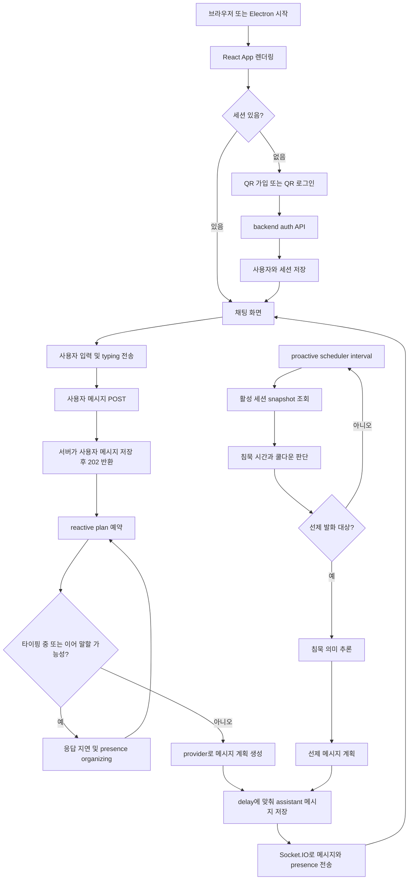
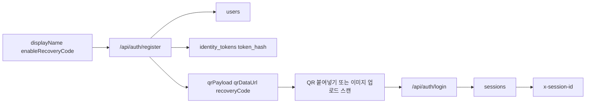
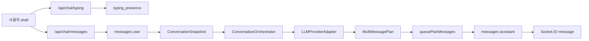
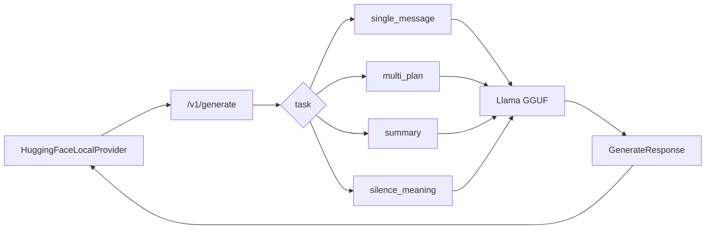
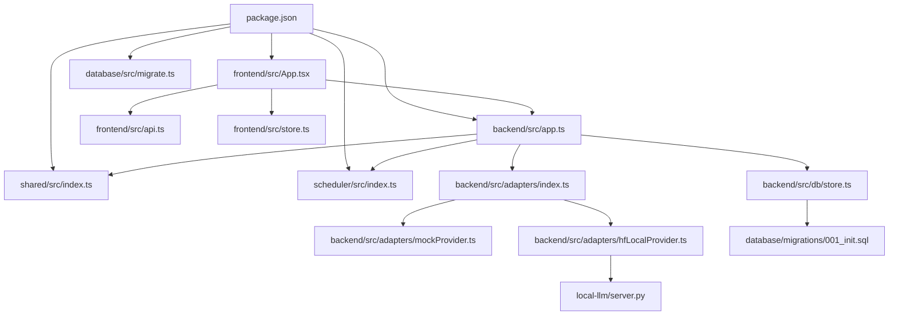

# ABSORB.md

이 문서는 [`README.md`](README.md)를 요약한 문서가 아니라, 저장소의 코드와 설정 파일을 직접 읽고 역추적한 구조 이해용 문서다. 코드에서 확인되지 않은 내용은 `확인 필요`로 표시했다.

## 1. 프로젝트 한 문장 요약

산마고우(Sammagou)는 사용자의 메시지 내용뿐 아니라 타이핑 상태, 침묵 시간, 감정 강도, 선제 발화 쿨다운을 함께 보고 “언제, 몇 개의 메시지로, 어떤 톤으로 응답할지”를 조절하는 이벤트 기반 AI 대화 프로토타입이다. 이름은 오래된 가까운 친구를 뜻하는 `죽마고우(竹馬故友)`에서 유래했다.

제품 표시 이름만 산마고우(Sammagou)로 변경했으며, 기존 디렉터리명과 `@turinglet/*`, `turinglet-id` 같은 내부 패키지·프로토콜 식별자는 호환성을 위해 유지한다.

## 2. 프로젝트가 해결하려는 문제

일반적인 챗봇은 사용자가 한 번 입력하면 AI가 바로 한 번 답하는 턴제 구조에 가깝다. 이 저장소는 그 구조에서 생기는 어색함, 예를 들어 사용자가 아직 말을 이어가려는데 끼어드는 문제, 사용자가 침묵 중일 때 너무 자주 재촉하는 문제, 감정적으로 무거운 상황에서 긴 해결책을 바로 던지는 문제를 줄이려 한다.

코드 기준으로 핵심 문제는 다음 세 가지다.

- [`frontend/src/components/ChatPanel.tsx`](frontend/src/components/ChatPanel.tsx)의 입력 이벤트가 [`/api/chat/typing`](backend/src/routes/chatRoutes.ts)으로 전달되어, 사용자가 입력 중이면 서버가 응답을 미룬다.
- [`backend/src/engine/orchestrator.ts`](backend/src/engine/orchestrator.ts)는 사용자 문장이 이어질 가능성이 높으면 `sendCount: 0` 계획을 반환한다.
- [`scheduler/src/index.ts`](scheduler/src/index.ts)는 긴 침묵과 쿨다운 조건을 검사해 선제 메시지 대상인지 결정한다.

## 3. 저장소 구조 요약

| 경로 | 종류 | 역할 | 중요도 | 비고 |
| -- | -- | -- | --- | -- |
| [`backend`](backend) | 코드 | Express, Socket.IO, 인증, 채팅 API, 반응 계획 실행, DB 접근을 담당한다. | High | 서버 실행의 중심이다. |
| [`backend/src/app.ts`](backend/src/app.ts) | 코드 | store, provider, route, runtime 모듈을 조립하는 composition root다. | High | 전체 의존성 연결을 볼 때 먼저 읽는다. |
| [`backend/src/server.ts`](backend/src/server.ts) | 코드 | HTTP 서버를 만들고 Socket.IO를 붙인 뒤 스케줄러를 시작한다. | High | 서버 엔트리포인트다. |
| [`backend/src/routes`](backend/src/routes) | 코드 | 인증, 채팅, 관리자 API route를 기능별로 나눈다. | High | API 동작은 여기서 읽는다. |
| [`backend/src/runtime`](backend/src/runtime) | 코드 | realtime emit, 메시지 큐, reactive planner, proactive loop를 나눈다. | High | 타이머와 Socket.IO 흐름의 중심이다. |
| [`backend/src/engine`](backend/src/engine) | 코드 | 대화 반응 계획과 침묵 의미 추론 래퍼가 있다. | High | 응답 타이밍 정책의 중심이다. |
| [`backend/src/adapters`](backend/src/adapters) | 코드 | mock provider와 로컬 HF provider를 선택하고 실행한다. | High | 메시지 생성과 fallback이 여기 있다. |
| [`backend/src/db`](backend/src/db) | 코드 | SQLite/PostgreSQL store 구현과 snapshot 생성 로직이 있다. | High | 대화 상태의 원천이다. |
| [`frontend`](frontend) | 코드 | React/Vite 채팅 UI, QR 가입/로그인, 관리자 대시보드를 담당한다. | High | 사용자 입력이 시작되는 곳이다. |
| [`frontend/src/App.tsx`](frontend/src/App.tsx) | 코드 | 일반 경로에서는 채팅/QR 인증 화면을, `/achrai/`에서는 관리자 화면을 고르는 최상위 컴포넌트다. | High | 화면 진입 흐름만 본다. |
| [`frontend/src/components`](frontend/src/components) | 코드 | [`AuthPanel`](frontend/src/components/AuthPanel.tsx), [`ChatPanel`](frontend/src/components/ChatPanel.tsx), [`AdminPanel`](frontend/src/components/AdminPanel.tsx)을 분리해 둔 UI 컴포넌트 폴더다. | High | 실제 프론트 기능은 여기서 읽는다. |
| [`frontend/src/styles`](frontend/src/styles) | 코드 | base/auth/chat/admin CSS를 기능별로 나눈다. | Medium | UI 스타일 읽기용. |
| [`frontend/src/api.ts`](frontend/src/api.ts) | 코드 | backend origin과 API 타입을 정의한다. | Medium | LAN 접속 시 host 기반 backend 주소를 만든다. |
| [`frontend/src/store.ts`](frontend/src/store.ts) | 코드 | Zustand 전역 상태를 정의한다. | Medium | 세션, 메시지, presence 상태 저장. |
| [`shared`](shared) | 코드 | 프론트/백엔드/스케줄러가 공유하는 타입을 정의한다. | High | 모듈 간 계약이다. |
| [`shared/src/index.ts`](shared/src/index.ts) | 코드 | `MessageRecord`, `ConversationSnapshot`, `LLMProviderAdapter`, `MultiMessagePlan` 등을 정의한다. | High | 타입 계약의 기준이다. |
| [`scheduler`](scheduler) | 코드 | 선제 발화 조건 판단을 독립 패키지로 제공한다. | High | proactive 정책의 핵심이다. |
| [`scheduler/src/index.ts`](scheduler/src/index.ts) | 코드 | `evaluateProactiveDecision`을 정의한다. | High | 침묵/쿨다운 판단 로직. |
| [`database`](database) | 코드/설정 | SQLite migration, seed, DB 경로 해석 유틸이 있다. | High | 로컬 DB 초기화 담당. |
| [`database/migrations/001_init.sql`](database/migrations/001_init.sql) | 데이터 | users, sessions, messages, proactive_events 등 테이블을 만든다. | High | DB 스키마 원본이다. |
| [`local-llm`](local-llm) | 코드 | FastAPI 기반 로컬 LLM 서버를 제공한다. | Medium | `LLM_PROVIDER=hf-local`일 때 사용. |
| [`local-llm/server.py`](local-llm/server.py) | 코드 | `/health`, `/v1/generate`를 제공하고 GGUF 모델을 로드한다. | Medium | 명시적 로컬 모델 경로를 우선하고, 다운로드는 opt-in이다. |
| [`prompt-engineering`](prompt-engineering) | 문서 | 시스템/침묵/안전/rapport/proactive 프롬프트 설계 문서. | Medium | 현재 코드에서 직접 import되는 것은 확인되지 않았다. |
| [`screenshots`](screenshots) | 이미지 | README 또는 수동 검증용으로 보이는 앱 화면 이미지. | Low | 코드에서 참조는 확인되지 않았다. |
| [`test-cases`](test-cases) | 이미지 | `.gitignore` 대상 수동 테스트 이미지 모음. | Low | 로컬에는 있으나 git 추적 대상은 아니다. |
| [`package.json`](package.json) | 설정 | npm workspace, dev/build/test/migrate/llm scripts를 정의한다. | High | 실행 명령의 기준이다. |
| [`package-lock.json`](package-lock.json) | 설정 | npm 의존성 lockfile이다. | Medium | 재현 가능한 설치에 필요하다. |
| [`pnpm-workspace.yaml`](pnpm-workspace.yaml) | 설정 | pnpm workspace 패키지 목록이다. | Low | 실제 root scripts는 npm workspace를 사용한다. |
| [`.env.example`](.env.example) | 설정 | 로컬 실행용 환경 변수 예시다. | High | `.env` 생성 기준이다. |
| [`.gitignore`](.gitignore) | 설정 | `.env`, DB, dist, node_modules, test-cases 등을 무시한다. | Medium | 산출물 구분에 중요하다. |
| [`.eslintrc.cjs`](.eslintrc.cjs) | 설정 | TypeScript ESLint 규칙과 import resolver를 정의한다. | Medium | lint 기준. |
| [`.prettierrc`](.prettierrc) | 설정 | 포매팅 규칙을 정의한다. | Low | 코드 스타일 기준. |
| [`tsconfig.base.json`](tsconfig.base.json) | 설정 | 모든 TS 패키지의 공통 compiler option이다. | Medium | strict 설정 포함. |
| [`run-llm-server.ps1`](run-llm-server.ps1) | 설정/기타 | LLM 서버를 자동 재시작하는 PowerShell 스크립트다. | Medium | Windows 실행 편의. |
| [`run-llm-server.bat`](run-llm-server.bat) | 설정/기타 | LLM 서버를 자동 재시작하는 batch 스크립트다. | Medium | Windows 실행 편의. |

## 4. 리소스 인벤토리

코드 외 리소스와 실행 보조 파일을 따로 정리한다. `.env`는 로컬에 존재하지만 [`.gitignore`](.gitignore) 대상이고 민감값이 있을 수 있어 내용은 읽지 않았다.

| 리소스 | 종류 | 사용 위치 | 역할 | 삭제하면 생기는 문제 |
| --- | -- | ----- | -- | ----------- |
| [`.env.example`](.env.example) | 설정 | [`backend/src/config.ts`](backend/src/config.ts), [`database/src/env.ts`](database/src/env.ts), [`local-llm/server.py`](local-llm/server.py) | 로컬 환경 변수 예시 | 새 환경에서 설정값을 만들 기준이 사라진다. |
| [`.env`](.env) | 설정 | 런타임 환경 | 실제 로컬 환경 변수 파일, 내용 미확인 | 로컬 DB/LLM/provider 설정이 사라질 수 있다. |
| [`package.json`](package.json) | 설정 | 루트 npm scripts | workspace 실행, build, test, migration, LLM server 실행 | 표준 실행 명령을 잃는다. |
| [`package-lock.json`](package-lock.json) | 설정 | npm install | 의존성 버전 고정 | 설치 재현성이 낮아진다. |
| [`pnpm-workspace.yaml`](pnpm-workspace.yaml) | 설정 | pnpm workspace | 패키지 목록 | pnpm 사용 시 workspace 인식이 깨진다. |
| [`tsconfig.base.json`](tsconfig.base.json) | 설정 | 모든 TS 패키지 tsconfig | 공통 TS strict 옵션 | 타입 검사 기준이 흐려진다. |
| [`.eslintrc.cjs`](.eslintrc.cjs) | 설정 | `npm run lint` | lint 규칙 | 코드 품질 검사 기준이 사라진다. |
| [`.prettierrc`](.prettierrc) | 설정 | formatter | 포매팅 규칙 | 코드 스타일 일관성이 줄어든다. |
| [`database/migrations/001_init.sql`](database/migrations/001_init.sql) | 데이터 | [`database/src/migrate.ts`](database/src/migrate.ts), [`backend/tests/auth-qr.test.ts`](backend/tests/auth-qr.test.ts) | DB 테이블과 인덱스 생성 | 앱 인증/채팅 저장소가 동작하지 않는다. |
| [`database/local-dev.db`](database/local-dev.db) | 데이터 | 로컬 SQLite 실행 | 로컬 대화/세션 데이터, `.gitignore` 대상 | 로컬 데이터가 초기화된다. migration으로 재생성 가능하다. |
| [`backend/database/local-dev.db`](backend/database/local-dev.db) | 데이터 | 로컬 실행 산출물 | 경로 문제로 생긴 backend 하위 DB로 보임 | 해당 경로를 쓰는 실행 데이터가 사라진다. |
| [`backend/database/test-auth.db`](backend/database/test-auth.db) | 데이터 | [`backend/tests/auth-qr.test.ts`](backend/tests/auth-qr.test.ts) | QR 테스트 임시 DB, `.gitignore` 대상 | 테스트 DB가 사라지지만 재생성 가능하다. |
| [`database/database/local-dev.db`](database/database/local-dev.db) | 데이터 | 로컬 실행 산출물 | 경로 문제로 생긴 database 하위 DB로 보임 | 해당 데이터가 사라진다. 정확한 생성 경로는 확인 필요. |
| [`local-llm/requirements.txt`](local-llm/requirements.txt) | 설정 | [`local-llm/server.py`](local-llm/server.py) | Python LLM 서버 의존성 목록 | LLM 서버 설치 방법을 잃는다. |
| [`prompt-engineering/system-prompt.md`](prompt-engineering/system-prompt.md) | 문서 | 프롬프트 설계 자료 | 상담형 assistant 시스템 원칙 | 설계 의도를 잃는다. 현재 코드 직접 참조는 확인 필요. |
| [`prompt-engineering/silence-interpretation-prompt.md`](prompt-engineering/silence-interpretation-prompt.md) | 문서 | 프롬프트 설계 자료 | 침묵 의미 후보와 operator action 정의 | proactive 설계 근거가 약해진다. 현재 코드 직접 참조는 확인 필요. |
| [`prompt-engineering/safety-sensitive-response-prompt.md`](prompt-engineering/safety-sensitive-response-prompt.md) | 문서 | 프롬프트 설계 자료 | 안전 민감 응답 원칙 | 안전 대응 설계 자료가 사라진다. 현재 코드 직접 참조는 확인 필요. |
| [`prompt-engineering/rapport-prompt.md`](prompt-engineering/rapport-prompt.md) | 문서 | 프롬프트 설계 자료 | rapport-first 스타일 기준 | 대화 톤 설계 근거가 약해진다. |
| [`prompt-engineering/proactive-outreach-prompt.md`](prompt-engineering/proactive-outreach-prompt.md) | 문서 | 프롬프트 설계 자료 | 선제 발화 제약 | proactive 메시지 설계 근거가 약해진다. |
| [`run-llm-server.ps1`](run-llm-server.ps1) | 기타 | LLM 서버 실행 | `npm run llm:server` 자동 재시작 | Windows에서 안정 실행 보조가 사라진다. |
| [`run-llm-server.bat`](run-llm-server.bat) | 기타 | LLM 서버 실행 | venv 활성화 후 자동 재시작 | batch 기반 실행 보조가 사라진다. |
| [`screenshots/44444 initial.png`](<screenshots/44444 initial.png>) | 이미지 | 코드 참조 없음 | 초기 화면 검증 이미지로 보임 | 수동 검증 증거가 줄어든다. |
| [`screenshots/66666 created id.png`](<screenshots/66666 created id.png>) | 이미지 | 코드 참조 없음 | QR/ID 생성 화면 검증 이미지로 보임 | 수동 검증 증거가 줄어든다. |
| [`screenshots/77777 chat initial.png`](<screenshots/77777 chat initial.png>) | 이미지 | 코드 참조 없음 | 채팅 초기 화면 검증 이미지로 보임 | 수동 검증 증거가 줄어든다. |
| [`screenshots/88888 async chat malfunc1.png`](<screenshots/88888 async chat malfunc1.png>) | 이미지 | 코드 참조 없음 | 비동기 채팅 문제 사례 이미지로 보임 | 문제 재현 자료가 줄어든다. |
| [`screenshots/94444 async chat malfunc2.png`](<screenshots/94444 async chat malfunc2.png>) | 이미지 | 코드 참조 없음 | 비동기 채팅 문제 사례 이미지로 보임 | 문제 재현 자료가 줄어든다. |
| [`test-cases/Screenshot_20260415_171809_Chrome.png`](test-cases/Screenshot_20260415_171809_Chrome.png) | 이미지 | 코드 참조 없음 | 로컬 수동 테스트 이미지, `.gitignore` 대상 | 수동 테스트 증거가 줄어든다. |
| [`test-cases/Screenshot_20260415_171818_Chrome.png`](test-cases/Screenshot_20260415_171818_Chrome.png) | 이미지 | 코드 참조 없음 | 로컬 수동 테스트 이미지, `.gitignore` 대상 | 수동 테스트 증거가 줄어든다. |
| [`test-cases/Screenshot_20260415_184410_Chrome.png`](test-cases/Screenshot_20260415_184410_Chrome.png) | 이미지 | 코드 참조 없음 | 로컬 수동 테스트 이미지, `.gitignore` 대상 | 수동 테스트 증거가 줄어든다. |
| [`test-cases/Screenshot_20260415_211659_Instagram.png`](test-cases/Screenshot_20260415_211659_Instagram.png) | 이미지 | 코드 참조 없음 | 로컬 수동 테스트 이미지, `.gitignore` 대상 | 수동 테스트 증거가 줄어든다. |
| [`test-cases/스크린샷 2026-04-12 171623.png`](<test-cases/스크린샷 2026-04-12 171623.png>) | 이미지 | 코드 참조 없음 | 로컬 수동 테스트 이미지, `.gitignore` 대상 | 수동 테스트 증거가 줄어든다. |
| [`test-cases/스크린샷 2026-04-12 172628.png`](<test-cases/스크린샷 2026-04-12 172628.png>) | 이미지 | 코드 참조 없음 | 로컬 수동 테스트 이미지, `.gitignore` 대상 | 수동 테스트 증거가 줄어든다. |
| [`test-cases/스크린샷 2026-04-13 163608.png`](<test-cases/스크린샷 2026-04-13 163608.png>) | 이미지 | 코드 참조 없음 | 로컬 수동 테스트 이미지, `.gitignore` 대상 | 수동 테스트 증거가 줄어든다. |
| [`test-cases/스크린샷 2026-04-13 170317.png`](<test-cases/스크린샷 2026-04-13 170317.png>) | 이미지 | 코드 참조 없음 | 로컬 수동 테스트 이미지, `.gitignore` 대상 | 수동 테스트 증거가 줄어든다. |
| [`test-cases/스크린샷 2026-04-13 223925.png`](<test-cases/스크린샷 2026-04-13 223925.png>) | 이미지 | 코드 참조 없음 | 로컬 수동 테스트 이미지, `.gitignore` 대상 | 수동 테스트 증거가 줄어든다. |
| [`test-cases/스크린샷 2026-04-13 224035.png`](<test-cases/스크린샷 2026-04-13 224035.png>) | 이미지 | 코드 참조 없음 | 로컬 수동 테스트 이미지, `.gitignore` 대상 | 수동 테스트 증거가 줄어든다. |
| [`test-cases/스크린샷 2026-04-14 115554.png`](<test-cases/스크린샷 2026-04-14 115554.png>) | 이미지 | 코드 참조 없음 | 로컬 수동 테스트 이미지, `.gitignore` 대상 | 수동 테스트 증거가 줄어든다. |
| [`test-cases/스크린샷 2026-04-14 122750.png`](<test-cases/스크린샷 2026-04-14 122750.png>) | 이미지 | 코드 참조 없음 | 로컬 수동 테스트 이미지, `.gitignore` 대상 | 수동 테스트 증거가 줄어든다. |
| [`test-cases/스크린샷 2026-04-14 135000.png`](<test-cases/스크린샷 2026-04-14 135000.png>) | 이미지 | 코드 참조 없음 | 로컬 수동 테스트 이미지, `.gitignore` 대상 | 수동 테스트 증거가 줄어든다. |

## 5. 전체 실행 흐름



단계별 관련 파일:

- 브라우저 진입점: [`frontend/index.html`](frontend/index.html), [`frontend/src/main.tsx`](frontend/src/main.tsx), [`frontend/src/App.tsx`](frontend/src/App.tsx)
- API client와 상태: [`frontend/src/api.ts`](frontend/src/api.ts), [`frontend/src/store.ts`](frontend/src/store.ts)
- 서버 진입점: [`backend/src/server.ts`](backend/src/server.ts)
- API route 등록과 dependency 조립: [`backend/src/app.ts`](backend/src/app.ts), [`backend/src/routes`](backend/src/routes)
- timer, queue, socket runtime: [`backend/src/runtime/reactivePlanner.ts`](backend/src/runtime/reactivePlanner.ts), [`backend/src/runtime/proactiveLoop.ts`](backend/src/runtime/proactiveLoop.ts), [`backend/src/runtime/messageQueue.ts`](backend/src/runtime/messageQueue.ts), [`backend/src/runtime/realtime.ts`](backend/src/runtime/realtime.ts)
- 반응 계획: [`backend/src/engine/orchestrator.ts`](backend/src/engine/orchestrator.ts), [`backend/src/engine/messageGenerator.ts`](backend/src/engine/messageGenerator.ts)
- 선제 발화 조건: [`scheduler/src/index.ts`](scheduler/src/index.ts)
- provider 선택과 실행: [`backend/src/adapters/index.ts`](backend/src/adapters/index.ts), [`backend/src/adapters/mockProvider.ts`](backend/src/adapters/mockProvider.ts), [`backend/src/adapters/hfLocalProvider.ts`](backend/src/adapters/hfLocalProvider.ts)
- DB 저장과 snapshot: [`backend/src/db/store.ts`](backend/src/db/store.ts), [`backend/src/db/sqliteStore.ts`](backend/src/db/sqliteStore.ts), [`backend/src/db/postgresStore.ts`](backend/src/db/postgresStore.ts), [`database/migrations/001_init.sql`](database/migrations/001_init.sql)

## 6. 데이터 흐름

### 6.1 인증 데이터 흐름



- 프론트 입력/스캔: [`AuthPanel`](frontend/src/components/AuthPanel.tsx), [`BrowserQRCodeReader`](frontend/src/components/AuthPanel.tsx)
- QR payload 생성/검증: [`encodeQrPayload`](backend/src/utils/qrPayload.ts), [`decodeQrPayload`](backend/src/utils/qrPayload.ts)
- public id와 recovery code 생성: [`generateLongPublicId`](backend/src/utils/security.ts), [`generateRecoveryCode`](backend/src/utils/security.ts), [`hashOptional`](backend/src/utils/security.ts)
- DB 저장: [`createUser`](backend/src/db/store.ts), [`createIdentityToken`](backend/src/db/store.ts), [`createSession`](backend/src/db/store.ts)

### 6.2 채팅 reactive 데이터 흐름



- 사용자 입력: [`ChatPanel`](frontend/src/components/ChatPanel.tsx)
- typing 전송 주기: [`onDraftChange`](frontend/src/components/ChatPanel.tsx)가 입력마다 `true`를 보내고 4초 뒤 `false`를 보낸다.
- 서버 typing 만료 기준: [`isUserTyping`](backend/src/db/store.ts)는 `last_typing_at` 이후 6000ms 이내만 typing으로 본다.
- 사용자 메시지 저장: [`appendMessage`](backend/src/db/store.ts)
- 반응 예약: [`scheduleReactivePlan`](backend/src/runtime/reactivePlanner.ts)
- 메시지 큐 실행: [`queuePlanMessages`](backend/src/runtime/messageQueue.ts)
- socket event 수신: [`socket.on('message')`](frontend/src/components/ChatPanel.tsx), [`socket.on('presence')`](frontend/src/components/ChatPanel.tsx)

### 6.3 선제 발화 데이터 흐름

```mermaid
flowchart LR
    Interval[setInterval] --> ActiveSessions[listActiveSessions]
    ActiveSessions --> Snapshot[getConversationSnapshot]
    Snapshot --> Decision[evaluateProactiveDecision]
    Decision --> Recent[listMessages]
    Recent --> Silence[inferSilence]
    Silence --> Plan[planForSilence]
    Plan --> Queue[queuePlanMessages]
    Queue --> Event[recordProactiveEvent]
```



- 주기 설정: [`config.proactivePollMs`](backend/src/config.ts)
- 조건 판단: [`evaluateProactiveDecision`](scheduler/src/index.ts)
- 침묵 의미 추론: [`MessageGenerator.inferSilence`](backend/src/engine/messageGenerator.ts), [`detectUserSilenceMeaning`](backend/src/adapters/mockProvider.ts), [`detectUserSilenceMeaning`](backend/src/adapters/hfLocalProvider.ts)
- 이벤트 기록: [`recordProactiveEvent`](backend/src/db/store.ts)

### 6.4 로컬 LLM 데이터 흐름



- backend caller: [`HuggingFaceLocalProvider.invoke`](backend/src/adapters/hfLocalProvider.ts)
- local server: [`local-llm/server.py`](local-llm/server.py)
- model 경로: [`local-llm/server.py`](local-llm/server.py)는 `HF_MODEL_PATH`가 가리키는 로컬 GGUF 파일을 먼저 사용한다.
- 명시적 다운로드: `HF_ALLOW_MODEL_DOWNLOAD=true`일 때만 `HF_MODEL_REPO`, `HF_MODEL_FILE`을 사용해 Hugging Face에서 받으며, cache 기본 위치는 repo 내부 `./local-llm/models`다.

## 7. 모듈 의존 관계



의존 관계를 코드 기준으로 풀면 다음과 같다.

- [`backend/src/app.ts`](backend/src/app.ts)는 [`@turinglet/scheduler`](scheduler/src/index.ts), [`@turinglet/shared`](shared/src/index.ts), [`createProvider`](backend/src/adapters/index.ts), [`createStore`](backend/src/db/index.ts)를 모두 사용한다.
- [`backend/src/adapters/hfLocalProvider.ts`](backend/src/adapters/hfLocalProvider.ts)는 실패 시 [`MockProvider`](backend/src/adapters/mockProvider.ts)로 fallback한다.
- [`backend/src/db/store.ts`](backend/src/db/store.ts)는 [`@turinglet/database`](database/src/index.ts)의 [`resolveSqlitePath`](database/src/env.ts)를 사용하지만, 자체적으로도 repo root 탐색 로직을 갖고 있다.
- [`frontend/src/App.tsx`](frontend/src/App.tsx)는 URL path와 [`frontend/src/store.ts`](frontend/src/store.ts)의 session 상태를 기준으로 일반 채팅 화면과 `/achrai/` 관리자 화면을 분기한다.
- [`local-llm/server.py`](local-llm/server.py)는 TypeScript 패키지에 직접 import되지 않고 HTTP endpoint로만 연결된다.

## 8. 핵심 기능별 구조

### QR 기반 가입과 로그인

- 목적: 긴 public id를 QR payload로 발급하고, QR payload를 통해 기존 사용자 세션을 복원한다.
- 관련 파일: [`frontend/src/App.tsx`](frontend/src/App.tsx), [`backend/src/app.ts`](backend/src/app.ts), [`backend/src/utils/qrPayload.ts`](backend/src/utils/qrPayload.ts), [`backend/src/utils/security.ts`](backend/src/utils/security.ts), [`backend/src/db/store.ts`](backend/src/db/store.ts)
- 관련 리소스: [`database/migrations/001_init.sql`](database/migrations/001_init.sql), [`screenshots/66666 created id.png`](<screenshots/66666 created id.png>)
- 주요 클래스: 확인 필요
- 주요 함수 또는 메서드: [`AuthPanel`](frontend/src/components/AuthPanel.tsx), [`encodeQrPayload`](backend/src/utils/qrPayload.ts), [`decodeQrPayload`](backend/src/utils/qrPayload.ts), [`generateLongPublicId`](backend/src/utils/security.ts), [`generateRecoveryCode`](backend/src/utils/security.ts), [`createUser`](backend/src/db/store.ts), [`createIdentityToken`](backend/src/db/store.ts), [`findUserByToken`](backend/src/db/store.ts), [`createSession`](backend/src/db/store.ts)
- 주요 변수 또는 상수: [`PREFIX`](backend/src/utils/qrPayload.ts), [`RegisterSchema`](backend/src/app.ts), [`LoginSchema`](backend/src/app.ts), [`RecoverSchema`](backend/src/app.ts)
- 입력: `displayName`, `enableRecoveryCode`, `qrPayload`, `recoveryCode`
- 처리: public id와 recovery code를 생성하고 token은 hash로 저장한다. QR payload는 `TLQR1:` prefix와 base64url JSON으로 만든다.
- 출력: `qrPayload`, `qrDataUrl`, `recoveryCode`, `sessionId`, `userId`
- 예외 또는 주의점: `/api/auth/login`은 QR payload 변조 시 `Malformed or forged QR payload`를 반환한다. 관리자 로그인은 별도 `/achrai/` 경로와 `/api/admin/login` 토큰 흐름을 사용한다.
- 내가 면접에서 설명해야 할 핵심: “QR에는 실제 DB id가 아니라 긴 public token payload가 들어가고, 서버는 token hash로 사용자를 찾은 뒤 최신 세션을 재사용합니다.”

### 사용자 메시지 reactive 응답

- 목적: 사용자의 메시지를 즉시 처리로 붙잡지 않고, 사용자가 말을 더 이어갈지 판단한 뒤 응답한다.
- 관련 파일: [`frontend/src/components/ChatPanel.tsx`](frontend/src/components/ChatPanel.tsx), [`backend/src/routes/chatRoutes.ts`](backend/src/routes/chatRoutes.ts), [`backend/src/runtime/reactivePlanner.ts`](backend/src/runtime/reactivePlanner.ts), [`backend/src/engine/orchestrator.ts`](backend/src/engine/orchestrator.ts), [`backend/src/adapters/mockProvider.ts`](backend/src/adapters/mockProvider.ts), [`backend/src/db/store.ts`](backend/src/db/store.ts)
- 관련 리소스: [`database/migrations/001_init.sql`](database/migrations/001_init.sql)
- 주요 클래스: [`ConversationOrchestrator`](backend/src/engine/orchestrator.ts), [`MockProvider`](backend/src/adapters/mockProvider.ts)
- 주요 함수 또는 메서드: [`scheduleReactivePlan`](backend/src/runtime/reactivePlanner.ts), [`queuePlanMessages`](backend/src/runtime/messageQueue.ts), [`planForUserMessage`](backend/src/engine/orchestrator.ts), [`generateMultiMessagePlan`](backend/src/adapters/mockProvider.ts), [`appendMessage`](backend/src/db/store.ts)
- 주요 변수 또는 상수: [`reactivePlanTimers`](backend/src/runtime/reactivePlanner.ts), [`reactiveSequence`](backend/src/runtime/reactivePlanner.ts), [`userContinuationGraceMs`](backend/src/config.ts), [`reactiveResponseMaxWaitMs`](backend/src/config.ts)
- 입력: 사용자의 `content`, session header `x-session-id`, typing state
- 처리: 사용자 메시지를 저장하고 socket으로 emit한다. 이후 delayed timer가 snapshot을 보고 `sendCount`가 0이면 기다리거나 강제 plan을 만든다.
- 출력: assistant message, presence event, DB message row
- 예외 또는 주의점: 응답 plan이 `sendCount: 0`이고 reason에 continuation/typing/defer가 포함되면 최대 대기 시간까지 재시도한다.
- 내가 면접에서 설명해야 할 핵심: “메시지 전송 API는 202를 즉시 반환하고, 실제 AI 응답은 별도 타이머에서 사용자의 추가 입력 가능성을 확인한 뒤 비동기로 보냅니다.”

### 사용자 typing presence

- 목적: 사용자가 입력 중이면 assistant가 끼어들지 않도록 한다.
- 관련 파일: [`frontend/src/components/ChatPanel.tsx`](frontend/src/components/ChatPanel.tsx), [`backend/src/routes/chatRoutes.ts`](backend/src/routes/chatRoutes.ts), [`backend/src/db/store.ts`](backend/src/db/store.ts), [`shared/src/index.ts`](shared/src/index.ts)
- 관련 리소스: [`database/migrations/001_init.sql`](database/migrations/001_init.sql)
- 주요 클래스: 확인 필요
- 주요 함수 또는 메서드: [`sendTyping`](frontend/src/components/ChatPanel.tsx), [`onDraftChange`](frontend/src/components/ChatPanel.tsx), [`setTypingPresence`](backend/src/db/store.ts), [`isUserTyping`](backend/src/db/store.ts)
- 주요 변수 또는 상수: frontend typing timer 4000ms, backend typing freshness 6000ms, [`TypingSchema`](backend/src/routes/schemas.ts)
- 입력: `{ isTyping: boolean }`
- 처리: 프론트는 입력마다 true를 보내고 4초 후 false를 보낸다. 서버는 DB에 typing state와 timestamp를 저장한다.
- 출력: `user_typing` socket event, `ConversationSnapshot.userTyping`
- 예외 또는 주의점: typing API는 [`createRateLimiter`](backend/src/rateLimit.ts)에서 rate limit 예외다.
- 내가 면접에서 설명해야 할 핵심: “typing은 단순 UI 표시가 아니라 서버의 응답 지연 정책에 직접 들어가는 신호입니다.”

### 침묵 기반 선제 발화

- 목적: 사용자가 오래 침묵하고 있고 쿨다운이 지난 경우, 낮은 압박의 짧은 메시지를 보낸다.
- 관련 파일: [`backend/src/runtime/proactiveLoop.ts`](backend/src/runtime/proactiveLoop.ts), [`scheduler/src/index.ts`](scheduler/src/index.ts), [`backend/src/engine/messageGenerator.ts`](backend/src/engine/messageGenerator.ts), [`backend/src/engine/orchestrator.ts`](backend/src/engine/orchestrator.ts), [`backend/src/db/store.ts`](backend/src/db/store.ts)
- 관련 리소스: [`prompt-engineering/proactive-outreach-prompt.md`](prompt-engineering/proactive-outreach-prompt.md), [`prompt-engineering/silence-interpretation-prompt.md`](prompt-engineering/silence-interpretation-prompt.md)
- 주요 클래스: [`MessageGenerator`](backend/src/engine/messageGenerator.ts), [`ConversationOrchestrator`](backend/src/engine/orchestrator.ts)
- 주요 함수 또는 메서드: [`runProactiveLoop`](backend/src/runtime/proactiveLoop.ts), [`startScheduler`](backend/src/runtime/proactiveLoop.ts), [`evaluateProactiveDecision`](scheduler/src/index.ts), [`inferSilence`](backend/src/engine/messageGenerator.ts), [`planForSilence`](backend/src/engine/orchestrator.ts), [`recordProactiveEvent`](backend/src/db/store.ts)
- 주요 변수 또는 상수: [`proactivePollMs`](backend/src/config.ts), [`proactiveMinSilenceMs`](backend/src/config.ts), [`proactiveCooldownMs`](backend/src/config.ts)
- 입력: active sessions, conversation snapshot, last proactive event timestamp
- 처리: 침묵 시간이 최소값보다 길고 쿨다운이 끝났는지 본다. typing이면 중단한다. silence meaning이 typing이면 중단한다.
- 출력: assistant proactive message, proactive_events row
- 예외 또는 주의점: [`recordProactiveEvent`](backend/src/db/store.ts)는 plan queue 직후 호출되므로, 이후 typing 때문에 메시지가 skip되어도 sent 이벤트가 남을 수 있다.
- 내가 면접에서 설명해야 할 핵심: “선제 발화는 LLM이 마음대로 먼저 말하는 것이 아니라, 침묵 시간과 쿨다운, typing 상태를 통과한 경우에만 계획됩니다.”

### 메시지 생성 provider와 fallback

- 목적: mock 기반 규칙 응답과 로컬 Hugging Face LLM 응답을 같은 interface로 사용한다.
- 관련 파일: [`shared/src/index.ts`](shared/src/index.ts), [`backend/src/adapters/index.ts`](backend/src/adapters/index.ts), [`backend/src/adapters/mockProvider.ts`](backend/src/adapters/mockProvider.ts), [`backend/src/adapters/hfLocalProvider.ts`](backend/src/adapters/hfLocalProvider.ts), [`local-llm/server.py`](local-llm/server.py)
- 관련 리소스: [`local-llm/requirements.txt`](local-llm/requirements.txt), [`run-llm-server.ps1`](run-llm-server.ps1), [`run-llm-server.bat`](run-llm-server.bat)
- 주요 클래스: [`MockProvider`](backend/src/adapters/mockProvider.ts), [`HuggingFaceLocalProvider`](backend/src/adapters/hfLocalProvider.ts), [`PlaceholderExternalProvider`](backend/src/adapters/index.ts)
- 주요 함수 또는 메서드: [`createProvider`](backend/src/adapters/index.ts), [`generateMessage`](backend/src/adapters/mockProvider.ts), [`generateMultiMessagePlan`](backend/src/adapters/mockProvider.ts), [`summarizeConversationState`](backend/src/adapters/mockProvider.ts), [`detectUserSilenceMeaning`](backend/src/adapters/mockProvider.ts), [`invoke`](backend/src/adapters/hfLocalProvider.ts)
- 주요 변수 또는 상수: [`LLMProviderAdapter`](shared/src/index.ts), [`HF_LOCAL_URL`](.env.example), [`HF_LOCAL_TIMEOUT_MS`](.env.example), [`MODEL_REPO`](local-llm/server.py), [`MODEL_FILE`](local-llm/server.py)
- 입력: snapshot, userText, recentMessages, silenceMeaning
- 처리: `LLM_PROVIDER=mock`이면 mock provider를 쓰고, `hf-local`이면 HTTP로 로컬 LLM 서버를 호출한다. 실패하면 mock으로 fallback한다.
- 출력: `MultiMessagePlan`, 단일 메시지, emotional summary, silence meaning
- 예외 또는 주의점: HF provider의 `nextState`는 문자열 존재만 확인하고 구체 enum 검증은 하지 않는다.
- 내가 면접에서 설명해야 할 핵심: “LLM 생성 자체는 adapter 뒤에 숨겨두고, 정책 엔진은 provider가 어떤 구현인지 몰라도 같은 `MultiMessagePlan`을 받습니다.”

### 감정 상태 요약과 snapshot

- 목적: 최근 대화의 감정 강도를 저장하고, reactive/proactive 정책에 사용한다.
- 관련 파일: [`backend/src/app.ts`](backend/src/app.ts), [`backend/src/db/store.ts`](backend/src/db/store.ts), [`backend/src/adapters/mockProvider.ts`](backend/src/adapters/mockProvider.ts), [`backend/src/adapters/hfLocalProvider.ts`](backend/src/adapters/hfLocalProvider.ts)
- 관련 리소스: [`database/migrations/001_init.sql`](database/migrations/001_init.sql)
- 주요 클래스: [`SqliteStore`](backend/src/db/store.ts), [`PostgresStore`](backend/src/db/store.ts)
- 주요 함수 또는 메서드: [`summarizeConversationState`](backend/src/adapters/mockProvider.ts), [`upsertEmotionalSnapshot`](backend/src/db/store.ts), [`getConversationSnapshot`](backend/src/db/store.ts), [`mapState`](backend/src/db/store.ts)
- 주요 변수 또는 상수: [`recentEmotionalIntensity`](shared/src/index.ts), `intensity >= 7`
- 입력: 최근 메시지 30개, sessionId
- 처리: 사용자 메시지 후 background task가 provider summary를 만들고 `emotional_state_snapshots`에 새 row를 insert한다.
- 출력: `ConversationSnapshot.recentEmotionalIntensity`, `SessionMachineState`
- 예외 또는 주의점: 함수 이름은 upsert지만 실제 구현은 매번 insert한다.
- 내가 면접에서 설명해야 할 핵심: “감정 강도는 실시간 응답 하나에만 쓰는 값이 아니라, 다음 침묵 판단과 세션 상태 계산에 재사용됩니다.”

### 관리자 대시보드

- 목적: 사용자, 세션, 메시지, proactive event를 확인한다.
- 관련 파일: [`frontend/src/components/AdminPanel.tsx`](frontend/src/components/AdminPanel.tsx), [`backend/src/routes/adminRoutes.ts`](backend/src/routes/adminRoutes.ts), [`backend/src/db/store.ts`](backend/src/db/store.ts)
- 관련 리소스: [`database/migrations/001_init.sql`](database/migrations/001_init.sql)
- 주요 클래스: 확인 필요
- 주요 함수 또는 메서드: [`AdminPanel`](frontend/src/components/AdminPanel.tsx), [`loadOverview`](frontend/src/components/AdminPanel.tsx), [`loadSessionMessages`](frontend/src/components/AdminPanel.tsx), [`listUsers`](backend/src/db/store.ts), [`listSessions`](backend/src/db/store.ts), [`listMessagesForSession`](backend/src/db/store.ts), [`listProactiveEvents`](backend/src/db/store.ts)
- 주요 변수 또는 상수: [`AdminOverview`](frontend/src/components/AdminPanel.tsx), [`AdminUserRow`](frontend/src/api.ts), [`AdminSessionRow`](frontend/src/api.ts), [`AdminProactiveEventRow`](frontend/src/api.ts)
- 입력: `/achrai/` 직접 접속, 앱 시작 시 생성된 `runtime/achrai-admin-key.bmp`, session id
- 처리: 백엔드는 시작할 때 64×64 크기의 1-bit 흑백 BMP에 흰 여백, 큰 finder eye 3개, 흑백 교차 timing pattern, 우측 하단 안쪽의 작은 alignment eye, 내부 랜덤 모듈을 그려 가짜 QR 키를 만든다. 실제 QR payload는 인코딩하지 않으며, 파일의 SHA-256 digest만 메모리에 보관한다. 프론트가 업로드한 BMP 원본을 `/api/admin/login`에 보내면 형식과 digest를 검사하고, 성공 시 받은 Bearer token으로 `/api/admin/overview`와 `/api/admin/sessions/:sessionId/messages`를 호출한다.
- 출력: 사용자/세션/메시지/선제 이벤트 테이블
- 예외 또는 주의점: 앱을 다시 시작하면 BMP 키 파일을 덮어쓰므로 이전 키는 사용할 수 없다. 키 파일은 [`.gitignore`](.gitignore)의 `runtime/` 규칙으로 제외된다. 토큰은 서버 메모리와 브라우저 `sessionStorage`에만 있으므로 서버 재시작이나 탭 종료 시 다시 로그인해야 한다.
- 내가 면접에서 설명해야 할 핵심: “운영용 완성 기능이라기보다, 프로토타입의 대화 상태와 선제 발화 이벤트를 눈으로 확인하기 위한 관찰 도구입니다.”

## 9. 핵심 식별자 사전

| 식별자 | 종류 | 위치 | 역할 | 함께 봐야 할 코드 |
| --- | -- | -- | -- | ---------- |
| [`createApp`](backend/src/app.ts) | 함수 | [`backend/src/app.ts`](backend/src/app.ts) | Express app, store, provider, orchestrator, scheduler loop를 조립한다. | [`backend/src/server.ts`](backend/src/server.ts) |
| [`attachSocket`](backend/src/runtime/realtime.ts) | 함수 | [`backend/src/runtime/realtime.ts`](backend/src/runtime/realtime.ts) | Socket.IO 서버를 만들고 `join_session` room을 처리한다. | [`ChatPanel`](frontend/src/components/ChatPanel.tsx) |
| [`scheduleReactivePlan`](backend/src/runtime/reactivePlanner.ts) | 함수 | [`backend/src/runtime/reactivePlanner.ts`](backend/src/runtime/reactivePlanner.ts) | 사용자 메시지 후 실제 assistant 응답을 지연 계획한다. | [`ConversationOrchestrator`](backend/src/engine/orchestrator.ts) |
| [`queuePlanMessages`](backend/src/runtime/messageQueue.ts) | 함수 | [`backend/src/runtime/messageQueue.ts`](backend/src/runtime/messageQueue.ts) | `MultiMessagePlan.messages`를 delay에 맞춰 저장/emit한다. | [`appendMessage`](backend/src/db/store.ts) |
| [`runProactiveLoop`](backend/src/runtime/proactiveLoop.ts) | 함수 | [`backend/src/runtime/proactiveLoop.ts`](backend/src/runtime/proactiveLoop.ts) | 활성 세션을 순회하며 선제 발화를 판단한다. | [`evaluateProactiveDecision`](scheduler/src/index.ts) |
| [`requireSession`](backend/src/routes/sessionAuth.ts) | 함수 | [`backend/src/routes/sessionAuth.ts`](backend/src/routes/sessionAuth.ts) | `x-session-id` header를 검증하고 session을 touch한다. | [`getSessionById`](backend/src/db/store.ts) |
| [`ConversationOrchestrator`](backend/src/engine/orchestrator.ts) | 클래스 | [`backend/src/engine/orchestrator.ts`](backend/src/engine/orchestrator.ts) | 사용자 메시지/침묵에 대한 응답 계획을 만든다. | [`MockProvider`](backend/src/adapters/mockProvider.ts) |
| [`likelyUserWillContinue`](backend/src/engine/orchestrator.ts) | 함수 | [`backend/src/engine/orchestrator.ts`](backend/src/engine/orchestrator.ts) | 짧은 조각, 연결어, 열린 어미 등으로 이어 말할 가능성을 판단한다. | [`looksLikeContinuation`](backend/src/adapters/mockProvider.ts) |
| [`planForUserMessage`](backend/src/engine/orchestrator.ts) | 메서드 | [`backend/src/engine/orchestrator.ts`](backend/src/engine/orchestrator.ts) | typing/continuation이면 `sendCount: 0`, 아니면 provider plan을 반환한다. | [`scheduleReactivePlan`](backend/src/runtime/reactivePlanner.ts) |
| [`planForSilence`](backend/src/engine/orchestrator.ts) | 메서드 | [`backend/src/engine/orchestrator.ts`](backend/src/engine/orchestrator.ts) | 감정 강도에 따라 empathy 또는 check-in 메시지를 만든다. | [`runProactiveLoop`](backend/src/runtime/proactiveLoop.ts) |
| [`MessageGenerator`](backend/src/engine/messageGenerator.ts) | 클래스 | [`backend/src/engine/messageGenerator.ts`](backend/src/engine/messageGenerator.ts) | provider의 단일 메시지 생성과 침묵 의미 추론을 감싼다. | [`HuggingFaceLocalProvider`](backend/src/adapters/hfLocalProvider.ts) |
| [`evaluateProactiveDecision`](scheduler/src/index.ts) | 함수 | [`scheduler/src/index.ts`](scheduler/src/index.ts) | typing, lastUserMessageAt, silence, cooldown으로 선제 발화 여부를 판단한다. | [`ProactiveDecisionInput`](shared/src/index.ts) |
| [`MockProvider`](backend/src/adapters/mockProvider.ts) | 클래스 | [`backend/src/adapters/mockProvider.ts`](backend/src/adapters/mockProvider.ts) | 규칙 기반 메시지 plan, 감정 강도, 침묵 의미를 만든다. | [`LLMProviderAdapter`](shared/src/index.ts) |
| [`HuggingFaceLocalProvider`](backend/src/adapters/hfLocalProvider.ts) | 클래스 | [`backend/src/adapters/hfLocalProvider.ts`](backend/src/adapters/hfLocalProvider.ts) | 로컬 LLM HTTP 서버를 호출하고 실패 시 mock fallback을 사용한다. | [`local-llm/server.py`](local-llm/server.py) |
| [`createProvider`](backend/src/adapters/index.ts) | 함수 | [`backend/src/adapters/index.ts`](backend/src/adapters/index.ts) | `config.llmProvider`에 따라 provider 구현을 선택한다. | [`config`](backend/src/config.ts) |
| [`SqliteStore`](backend/src/db/sqliteStore.ts) | 클래스 | [`backend/src/db/sqliteStore.ts`](backend/src/db/sqliteStore.ts) | SQLite 기반 `Store` 구현이다. | [`database/migrations/001_init.sql`](database/migrations/001_init.sql) |
| [`PostgresStore`](backend/src/db/postgresStore.ts) | 클래스 | [`backend/src/db/postgresStore.ts`](backend/src/db/postgresStore.ts) | PostgreSQL 기반 `Store` 구현이다. | [`createStore`](backend/src/db/index.ts) |
| [`Store`](backend/src/db/types.ts) | interface | [`backend/src/db/types.ts`](backend/src/db/types.ts) | 사용자/세션/메시지/typing/proactive/snapshot 메서드 계약이다. | [`SqliteStore`](backend/src/db/sqliteStore.ts) |
| [`getConversationSnapshot`](backend/src/db/sqliteMessages.ts) | 메서드 | [`backend/src/db/sqliteMessages.ts`](backend/src/db/sqliteMessages.ts) | 최근 메시지 시간, 감정 강도, typing 상태를 `ConversationSnapshot`으로 합친다. | [`ConversationSnapshot`](shared/src/index.ts) |
| [`setTypingPresence`](backend/src/db/sqlitePresenceEvents.ts) | 메서드 | [`backend/src/db/sqlitePresenceEvents.ts`](backend/src/db/sqlitePresenceEvents.ts) | typing state를 insert/update한다. | [`isUserTyping`](backend/src/db/sqlitePresenceEvents.ts) |
| [`isUserTyping`](backend/src/db/sqlitePresenceEvents.ts) | 메서드 | [`backend/src/db/sqlitePresenceEvents.ts`](backend/src/db/sqlitePresenceEvents.ts) | 6000ms freshness 기준으로 typing 여부를 판단한다. | [`scheduleReactivePlan`](backend/src/runtime/reactivePlanner.ts) |
| [`encodeQrPayload`](backend/src/utils/qrPayload.ts) | 함수 | [`backend/src/utils/qrPayload.ts`](backend/src/utils/qrPayload.ts) | QR payload를 `TLQR1:` prefix + base64url JSON으로 만든다. | [`decodeQrPayload`](backend/src/utils/qrPayload.ts) |
| [`decodeQrPayload`](backend/src/utils/qrPayload.ts) | 함수 | [`backend/src/utils/qrPayload.ts`](backend/src/utils/qrPayload.ts) | QR payload를 파싱하고 Zod schema로 검증한다. | [`LoginSchema`](backend/src/routes/schemas.ts) |
| [`createRateLimiter`](backend/src/rateLimit.ts) | 함수 | [`backend/src/rateLimit.ts`](backend/src/rateLimit.ts) | IP 기반 in-memory rate limit middleware를 만든다. | [`config.rateLimitMax`](backend/src/config.ts) |
| [`config`](backend/src/config.ts) | 상수 | [`backend/src/config.ts`](backend/src/config.ts) | 환경 변수와 fallback을 모은 runtime 설정이다. | [`.env.example`](.env.example) |
| [`resolveSqlitePath`](database/src/env.ts) | 함수 | [`database/src/env.ts`](database/src/env.ts) | repo root 기준 SQLite 경로를 계산한다. | [`database/src/migrate.ts`](database/src/migrate.ts) |
| [`migrate.ts`](database/src/migrate.ts) | 스크립트 | [`database/src/migrate.ts`](database/src/migrate.ts) | SQL migration 파일을 SQLite DB에 적용한다. | [`database/migrations/001_init.sql`](database/migrations/001_init.sql) |
| [`App`](frontend/src/App.tsx) | component | [`frontend/src/App.tsx`](frontend/src/App.tsx) | `/achrai/` 경로에서는 관리자 화면을, 그 외에는 세션 여부에 따라 채팅 또는 QR 인증 화면을 고른다. | [`useAppStore`](frontend/src/store.ts) |
| [`AuthPanel`](frontend/src/components/AuthPanel.tsx) | component | [`frontend/src/components/AuthPanel.tsx`](frontend/src/components/AuthPanel.tsx) | QR 가입, QR 로그인, QR payload 붙여넣기와 이미지 업로드 스캔을 처리한다. | [`api`](frontend/src/api.ts) |
| [`ChatPanel`](frontend/src/components/ChatPanel.tsx) | component | [`frontend/src/components/ChatPanel.tsx`](frontend/src/components/ChatPanel.tsx) | 메시지 조회, socket 구독, typing 전송, 메시지 전송을 처리한다. | [`scheduleReactivePlan`](backend/src/runtime/reactivePlanner.ts) |
| [`AdminPanel`](frontend/src/components/AdminPanel.tsx) | component | [`frontend/src/components/AdminPanel.tsx`](frontend/src/components/AdminPanel.tsx) | 관리자 로그인, overview, 세션 메시지 조회를 처리한다. | [`/api/admin/login`](backend/src/routes/adminRoutes.ts), [`/api/admin/overview`](backend/src/routes/adminRoutes.ts) |
| [`useAppStore`](frontend/src/store.ts) | hook/store | [`frontend/src/store.ts`](frontend/src/store.ts) | session, QR, messages, presence 상태를 저장한다. | [`ChatPanel`](frontend/src/components/ChatPanel.tsx) |
| [`api`](frontend/src/api.ts) | service | [`frontend/src/api.ts`](frontend/src/api.ts) | Axios instance와 API row type을 정의한다. | [`backendOrigin`](frontend/src/api.ts) |
| [`GenerateRequest`](local-llm/server.py) | class | [`local-llm/server.py`](local-llm/server.py) | `/v1/generate` 요청 body schema다. | [`generate`](local-llm/server.py) |
| [`generate`](local-llm/server.py) | 함수/route | [`local-llm/server.py`](local-llm/server.py) | task별 LLM 응답을 생성한다. | [`HuggingFaceLocalProvider.invoke`](backend/src/adapters/hfLocalProvider.ts) |

## 10. 핵심 알고리즘 또는 처리 로직

### Reactive 응답 지연 알고리즘

- 무엇을 하는가: 사용자 메시지를 저장한 뒤 즉시 응답하지 않고, 사용자가 입력 중인지와 문장이 이어질 가능성이 있는지 보고 응답을 지연한다.
- 왜 필요한가: 사용자가 아직 말을 이어가는 구간에서 assistant가 끼어드는 것을 줄이기 위해서다.
- 관련 파일: [`backend/src/runtime/reactivePlanner.ts`](backend/src/runtime/reactivePlanner.ts), [`backend/src/engine/orchestrator.ts`](backend/src/engine/orchestrator.ts), [`backend/src/db/store.ts`](backend/src/db/store.ts)
- 관련 함수 또는 클래스: [`scheduleReactivePlan`](backend/src/runtime/reactivePlanner.ts), [`ConversationOrchestrator.planForUserMessage`](backend/src/engine/orchestrator.ts), [`isUserTyping`](backend/src/db/sqlitePresenceEvents.ts)
- 어떤 입력을 받는가: `sessionId`, `userText`, `ConversationSnapshot`, typing state
- 어떤 출력을 만드는가: `MultiMessagePlan` 또는 delayed retry
- 시간 또는 성능상 주의할 점: 각 session에 하나의 [`reactivePlanTimers`](backend/src/runtime/reactivePlanner.ts)만 유지하며, retry는 attempt 20회와 [`reactiveResponseMaxWaitMs`](backend/src/config.ts)로 제한된다.
- 개선 가능성: continuation 판단 정규식이 한국어 일부 패턴에 의존하므로, 실제 대화 로그 기반 오판 분석이 필요하다.

### 선제 발화 조건 판단 알고리즘

- 무엇을 하는가: active session별로 침묵 시간이 충분히 길고 쿨다운이 지났는지 판단한다.
- 왜 필요한가: AI가 먼저 말을 걸 수 있게 하되, 재촉처럼 느껴지는 반복 발화를 막기 위해서다.
- 관련 파일: [`scheduler/src/index.ts`](scheduler/src/index.ts), [`backend/src/runtime/proactiveLoop.ts`](backend/src/runtime/proactiveLoop.ts)
- 관련 함수 또는 클래스: [`evaluateProactiveDecision`](scheduler/src/index.ts), [`runProactiveLoop`](backend/src/runtime/proactiveLoop.ts)
- 어떤 입력을 받는가: `snapshot`, `now`, `lastOutreachAt`, `minSilenceMs`, `cooldownMs`
- 어떤 출력을 만드는가: `ProactiveDecision.shouldSend`, `reason`, `suggestedState`
- 시간 또는 성능상 주의할 점: [`startScheduler`](backend/src/runtime/proactiveLoop.ts)는 [`config.proactivePollMs`](backend/src/config.ts)마다 모든 active session을 순회한다. 세션 수가 많아지면 DB query 수가 증가한다.
- 개선 가능성: proactive event와 실제 message send 성공 여부를 연결해 sent/skip 상태를 더 정확히 기록할 수 있다.

### MockProvider 메시지 plan 생성

- 무엇을 하는가: greeting, continuation, 감정 테마, 감정 강도, 질문 여부, 긴 텍스트 여부에 따라 여러 개의 짧은 메시지 plan을 만든다.
- 왜 필요한가: 외부 LLM 없이도 대화 타이밍과 multi-message UI를 검증하기 위해서다.
- 관련 파일: [`backend/src/adapters/mockProvider.ts`](backend/src/adapters/mockProvider.ts)
- 관련 함수 또는 클래스: [`MockProvider.generateMultiMessagePlan`](backend/src/adapters/mockProvider.ts), [`detectTheme`](backend/src/adapters/mockProvider.ts), [`pickIntensityFromText`](backend/src/adapters/mockProvider.ts), [`buildBurst`](backend/src/adapters/mockProvider.ts)
- 어떤 입력을 받는가: `snapshot`, `userText`, 선택적 `silenceMeaning`
- 어떤 출력을 만드는가: `sendCount`, `reason`, `nextState`, `messages[]`
- 시간 또는 성능상 주의할 점: 규칙 기반이라 빠르지만 실제 언어 다양성에는 취약하다.
- 개선 가능성: 테마/강도 판단을 테스트 fixture로 늘리고, high emotional load 메시지 개수를 사용자 경험 기준으로 조정할 수 있다.

### HF local provider fallback 로직

- 무엇을 하는가: backend가 [`local-llm/server.py`](local-llm/server.py)의 `/v1/generate`를 호출하고, 실패하거나 응답 구조가 맞지 않으면 [`MockProvider`](backend/src/adapters/mockProvider.ts)를 사용한다.
- 왜 필요한가: 로컬 모델이 느리거나 실패해도 앱 흐름을 끊지 않기 위해서다.
- 관련 파일: [`backend/src/adapters/hfLocalProvider.ts`](backend/src/adapters/hfLocalProvider.ts), [`backend/src/adapters/mockProvider.ts`](backend/src/adapters/mockProvider.ts), [`local-llm/server.py`](local-llm/server.py)
- 관련 함수 또는 클래스: [`HuggingFaceLocalProvider.invoke`](backend/src/adapters/hfLocalProvider.ts), [`aiSinglePlanFallback`](backend/src/adapters/hfLocalProvider.ts), [`generateMultiMessagePlan`](backend/src/adapters/hfLocalProvider.ts)
- 어떤 입력을 받는가: task와 payload
- 어떤 출력을 만드는가: 검증된 `MultiMessagePlan`, summary, silence meaning
- 시간 또는 성능상 주의할 점: [`hfLocalTimeoutMs`](backend/src/config.ts) timeout이 걸리면 fallback한다. 로컬 LLM은 첫 로딩과 모델 다운로드가 무겁다.
- 개선 가능성: `nextState` enum 검증과 task별 structured output 검증을 더 엄격히 할 수 있다.

### QR payload encoding 로직

- 무엇을 하는가: `{ v: 1, type: 'turinglet-id', token }` JSON을 base64url로 인코딩하고 `TLQR1:` prefix를 붙인다.
- 왜 필요한가: QR 로그인 payload의 형식과 버전을 명확히 하기 위해서다.
- 관련 파일: [`backend/src/utils/qrPayload.ts`](backend/src/utils/qrPayload.ts), [`backend/src/app.ts`](backend/src/app.ts)
- 관련 함수 또는 클래스: [`encodeQrPayload`](backend/src/utils/qrPayload.ts), [`decodeQrPayload`](backend/src/utils/qrPayload.ts), [`QrSchema`](backend/src/utils/qrPayload.ts)
- 어떤 입력을 받는가: `QrPayload`
- 어떤 출력을 만드는가: QR payload string
- 시간 또는 성능상 주의할 점: 성능 부담은 작다.
- 개선 가능성: token rotation, revocation, QR 만료 정책을 추가할 수 있다.

### DB snapshot 생성 로직

- 무엇을 하는가: 마지막 사용자 메시지 시각, 마지막 assistant 메시지 시각, 마지막 전체 메시지 시각, 최신 감정 강도, typing 여부를 합쳐 snapshot을 만든다.
- 왜 필요한가: scheduler와 orchestrator가 DB 전체를 직접 보지 않고, 작은 상태 객체만으로 정책을 판단하게 하기 위해서다.
- 관련 파일: [`backend/src/db/store.ts`](backend/src/db/store.ts), [`backend/src/db/sqliteMessages.ts`](backend/src/db/sqliteMessages.ts), [`backend/src/db/postgresMessages.ts`](backend/src/db/postgresMessages.ts), [`shared/src/index.ts`](shared/src/index.ts)
- 관련 함수 또는 클래스: [`getConversationSnapshot`](backend/src/db/sqliteMessages.ts), [`mapState`](backend/src/db/common.ts), [`ConversationSnapshot`](shared/src/index.ts)
- 어떤 입력을 받는가: `sessionId`
- 어떤 출력을 만드는가: `ConversationSnapshot`
- 시간 또는 성능상 주의할 점: SQLite 구현은 여러 SELECT를 순차 실행한다. Postgres 구현은 일부를 `Promise.all`로 병렬화한다.
- 개선 가능성: session별 최신 상태 materialized table을 두면 proactive loop 비용을 줄일 수 있다.

## 11. 설정값과 파라미터

| 이름 | 위치 | 의미 | 기본값 | 바꾸면 생기는 영향 |
| -- | -- | -- | --- | ---------- |
| `PORT` | [`.env.example`](.env.example), [`backend/src/config.ts`](backend/src/config.ts) | backend HTTP port | `4000` | frontend API/socket 연결 port가 달라진다. |
| `DB_PROVIDER` | [`.env.example`](.env.example), [`backend/src/config.ts`](backend/src/config.ts) | `sqlite` 또는 `postgres` 선택 | `sqlite` | 저장소 구현이 바뀐다. PostgreSQL migration은 확인 필요. |
| `SQLITE_PATH` | [`.env.example`](.env.example), [`database/src/env.ts`](database/src/env.ts), [`backend/src/config.ts`](backend/src/config.ts) | SQLite DB 파일 경로 | `./database/local-dev.db` | 로컬 데이터 저장 위치가 바뀐다. |
| `POSTGRES_URL` | [`.env.example`](.env.example), [`backend/src/config.ts`](backend/src/config.ts) | PostgreSQL 연결 문자열 | `postgres://localhost:5432/turinglet` in example, code fallback 빈 문자열 | postgres 선택 시 필요하다. |
| `RATE_LIMIT_WINDOW_MS` | [`.env.example`](.env.example), [`backend/src/config.ts`](backend/src/config.ts) | rate limit 시간 창 | `60000` | 요청 제한 주기가 바뀐다. |
| `RATE_LIMIT_MAX` | [`.env.example`](.env.example), [`backend/src/config.ts`](backend/src/config.ts) | 시간 창당 최대 요청 수 | `30` | 너무 낮으면 채팅/인증 요청이 막힌다. |
| `PROACTIVE_POLL_MS` | [`.env.example`](.env.example), [`backend/src/config.ts`](backend/src/config.ts) | proactive loop interval | `5000` | 선제 발화 판단 빈도가 바뀐다. |
| `PROACTIVE_MIN_SILENCE_MS` | [`.env.example`](.env.example), [`backend/src/config.ts`](backend/src/config.ts) | 선제 발화 최소 침묵 시간 | `120000` | 낮추면 더 자주 먼저 말한다. |
| `PROACTIVE_COOLDOWN_MS` | [`.env.example`](.env.example), [`backend/src/config.ts`](backend/src/config.ts) | 선제 발화 쿨다운 | `240000` | 낮추면 반복 check-in이 잦아진다. |
| `USER_CONTINUATION_GRACE_MS` | [`.env.example`](.env.example), [`backend/src/config.ts`](backend/src/config.ts) | 사용자 메시지 후 첫 reactive 판단 대기 시간 | `600` | 짧으면 응답이 빨라지고, 길면 이어 말하기를 더 기다린다. |
| `REACTIVE_RESPONSE_MAX_WAIT_MS` | [`.env.example`](.env.example), [`backend/src/config.ts`](backend/src/config.ts) | continuation으로 응답을 미룰 수 있는 최대 시간 | `20000` | 길면 응답 지연이 늘 수 있다. |
| `MOCK_PROVIDER` | [`.env.example`](.env.example), [`backend/src/config.ts`](backend/src/config.ts) | mock provider 사용 여부에 영향 | `true` unless `false` | `false`면 providerMode fallback이 `hf-local`로 간다. |
| `LLM_PROVIDER` | [`.env.example`](.env.example), [`backend/src/config.ts`](backend/src/config.ts) | `mock` 또는 `hf-local` provider 선택 | `mock` | 로컬 LLM 사용 여부가 바뀐다. |
| `HF_LOCAL_URL` | [`.env.example`](.env.example), [`backend/src/config.ts`](backend/src/config.ts) | local LLM endpoint origin | `http://127.0.0.1:8010` | HF provider 호출 대상이 바뀐다. |
| `HF_LOCAL_TIMEOUT_MS` | [`.env.example`](.env.example), [`backend/src/config.ts`](backend/src/config.ts) | HF provider timeout | `30000` | 길면 느린 모델을 더 기다리고, 짧으면 fallback이 빨라진다. |
| `VITE_BACKEND_ORIGIN` | [`frontend/src/api.ts`](frontend/src/api.ts), [`frontend/src/components/ChatPanel.tsx`](frontend/src/components/ChatPanel.tsx) | 프론트에서 backend origin override | 미설정 시 현재 host의 `:4000` | LAN/배포 환경에서 API 주소를 바꾼다. |
| `HF_MODEL_PATH` | [`.env.example`](.env.example), [`local-llm/server.py`](local-llm/server.py) | 로컬 GGUF 모델 파일 경로 | 빈 값 | 설정하면 자동 다운로드 없이 해당 파일을 로드한다. |
| `HF_ALLOW_MODEL_DOWNLOAD` | [`.env.example`](.env.example), [`local-llm/server.py`](local-llm/server.py) | Hugging Face 모델 다운로드 허용 여부 | `false` | `true`일 때만 네트워크 다운로드를 시도한다. |
| `HF_MODEL_CACHE_DIR` | [`.env.example`](.env.example), [`local-llm/server.py`](local-llm/server.py) | 다운로드 모델 cache 위치 | `./local-llm/models` | repo 내부 경로를 기본값으로 사용한다. |
| `HF_MODEL_REPO` | [`.env.example`](.env.example), [`local-llm/server.py`](local-llm/server.py) | Hugging Face model repo | `bartowski/Qwen2.5-1.5B-Instruct-GGUF` | 다운로드 opt-in 시 받을 GGUF repo가 바뀐다. |
| `HF_MODEL_FILE` | [`.env.example`](.env.example), [`local-llm/server.py`](local-llm/server.py) | Hugging Face model file | `Qwen2.5-1.5B-Instruct-Q4_K_M.gguf` | 모델 크기/성능/메모리 요구량이 바뀐다. |
| `HF_LOCAL_HOST` | [`local-llm/server.py`](local-llm/server.py) | local LLM bind host | `127.0.0.1` | 외부 기기 접근 가능성이 바뀐다. |
| `HF_LOCAL_PORT` | [`local-llm/server.py`](local-llm/server.py) | local LLM port | `8010` | backend `HF_LOCAL_URL`도 맞춰야 한다. |
| `BURST_PRESENCE_SEQUENCE` | [`backend/src/adapters/mockProvider.ts`](backend/src/adapters/mockProvider.ts) | multi-message 전송 전 presence 순서 | `typing`, `thinking`, `organizing` | assistant 상태 표시 리듬이 바뀐다. |
| typing debounce | [`frontend/src/components/ChatPanel.tsx`](frontend/src/components/ChatPanel.tsx) | 입력 멈춤 후 typing false 전송 시간 | `4000ms` | 너무 짧으면 사용자가 아직 입력 중인데 false가 될 수 있다. |
| typing freshness | [`backend/src/db/sqlitePresenceEvents.ts`](backend/src/db/sqlitePresenceEvents.ts), [`backend/src/db/postgresPresenceEvents.ts`](backend/src/db/postgresPresenceEvents.ts) | typing true를 유효하게 보는 시간 | `6000ms` | 너무 길면 assistant 응답이 과하게 지연된다. |
| Electron retry count | [`frontend/electron/main.ts`](frontend/electron/main.ts), [`frontend/electron/main.mjs`](frontend/electron/main.mjs) | Vite URL load retry 횟수 | `30` | 프론트 서버가 늦게 켜질 때 대기 시간이 바뀐다. |
| local LLM `n_ctx` | [`local-llm/server.py`](local-llm/server.py) | Llama context size | `2048` | 긴 대화 처리 가능량과 메모리 사용량에 영향. |
| local LLM `n_threads` | [`local-llm/server.py`](local-llm/server.py) | CPU thread 수 | `os.cpu_count()/2` | 추론 속도와 CPU 점유율에 영향. |

## 12. 실행 방법

현재 저장소 기준으로 확인된 명령은 [`package.json`](package.json)과 각 package의 [`package.json`](backend/package.json)을 기준으로 정리한다.

### 필요 환경

- Node.js와 npm: 정확한 최소 버전은 코드에서 확인 필요.
- Python venv: [`local-llm/requirements.txt`](local-llm/requirements.txt)에 필요한 Python 패키지가 정의되어 있다. 정확한 최소 Python 버전은 확인 필요.
- SQLite: [`better-sqlite3`](backend/package.json)을 사용한다.
- 로컬 LLM을 쓰려면 로컬 GGUF 모델 경로(`HF_MODEL_PATH`)가 필요하다. Hugging Face 다운로드는 `HF_ALLOW_MODEL_DOWNLOAD=true`를 명시한 경우에만 시도한다.

### 설치 명령

```powershell
npm install
```

로컬 LLM 의존성:

```powershell
python -m venv .venv-llm
.\.venv-llm\Scripts\Activate.ps1
python -m pip install --upgrade pip
pip install -r local-llm/requirements.txt
```

### 환경 변수 준비

```powershell
Copy-Item .env.example .env -Force
```

mock provider만 쓰려면 [`.env.example`](.env.example)의 `LLM_PROVIDER=mock`, `MOCK_PROVIDER=true` 흐름을 사용한다. 로컬 LLM을 쓰려면 `LLM_PROVIDER=hf-local`, `HF_LOCAL_URL=http://127.0.0.1:8010`, 그리고 `HF_MODEL_PATH` 또는 `HF_ALLOW_MODEL_DOWNLOAD=true`가 필요하다.

### DB migration

```powershell
npm run migrate
```

이 명령은 [`database/src/migrate.ts`](database/src/migrate.ts)를 실행해 [`database/migrations/001_init.sql`](database/migrations/001_init.sql)을 SQLite DB에 적용한다.

### 개발 실행

```powershell
npm run dev
```

루트 [`package.json`](package.json)의 `predev`가 먼저 [`shared`](shared), [`scheduler`](scheduler), [`database`](database)를 build하고 migration을 실행한 뒤, [`backend`](backend)와 [`frontend`](frontend)를 동시에 실행한다.

기본 주소:

- frontend: `http://localhost:5173`
- backend: `http://localhost:4000`
- 관리자 대시보드: `http://localhost:5173/achrai/`

프론트 dev server는 `0.0.0.0:5173`으로 바인딩되므로 같은 Wi-Fi의 스마트폰에서도 `http://PC의_사설IP:5173`으로 접속할 수 있다. 관리자 화면은 `http://PC의_사설IP:5173/achrai/`를 사용한다.

### 로컬 LLM 서버 실행

이미 받은 GGUF 모델을 쓰는 경우:

```env
HF_MODEL_PATH=C:/models/Qwen2.5-1.5B-Instruct-Q4_K_M.gguf
```

명시적으로 다운로드를 허용하는 경우:

```env
HF_ALLOW_MODEL_DOWNLOAD=true
HF_MODEL_CACHE_DIR=./local-llm/models
```

```powershell
npm run llm:server
```

또는 자동 재시작:

```powershell
.\run-llm-server.ps1
```

health check:

```powershell
curl.exe http://127.0.0.1:8010/health
```

### 빌드 명령

```powershell
npm run build
```

루트 build는 [`shared`](shared), [`scheduler`](scheduler), [`database`](database), [`backend`](backend), [`frontend`](frontend) 순서로 build한다.

### 테스트 명령

```powershell
npm test
```

테스트 구성에는 [`backend/tests/policy.test.ts`](backend/tests/policy.test.ts)의 정책 테스트, [`backend/tests/auth-qr.test.ts`](backend/tests/auth-qr.test.ts)의 QR 인증 테스트, [`backend/tests/admin-auth.test.ts`](backend/tests/admin-auth.test.ts)의 관리자 BMP 인증 테스트가 있다. 2026-06-12 변경에서는 TypeScript build와 실제 HTTP 로그인 수동 검증은 통과했지만, Vitest는 샌드박스의 `esbuild spawn EPERM` 때문에 실행하지 못했다.

## 13. 테스트와 검증 방법

| 검증 대상 | 방법 | 관련 파일 | 결과물 | 해석 방법 |
| ----- | -- | ----- | --- | ----- |
| proactive 정책 | `npm test` 중 [`backend/tests/policy.test.ts`](backend/tests/policy.test.ts) | [`scheduler/src/index.ts`](scheduler/src/index.ts), [`backend/src/engine/orchestrator.ts`](backend/src/engine/orchestrator.ts) | Vitest 결과 | 긴 침묵+쿨다운, typing 중 응답 금지, high emotional silence 정책을 검증한다. 실제 실행에서 통과 확인. |
| QR 인증 | `npm test` 중 [`backend/tests/auth-qr.test.ts`](backend/tests/auth-qr.test.ts) | [`backend/src/routes/authRoutes.ts`](backend/src/routes/authRoutes.ts), [`database/migrations/001_init.sql`](database/migrations/001_init.sql) | Vitest 결과 | QR payload 발급, 로그인 성공, payload 변조 실패를 확인한다. 현재 통과 확인. |
| 관리자 인증 | `npm test` 중 [`backend/tests/admin-auth.test.ts`](backend/tests/admin-auth.test.ts) | [`backend/src/routes/adminRoutes.ts`](backend/src/routes/adminRoutes.ts), [`backend/src/utils/adminBitmap.ts`](backend/src/utils/adminBitmap.ts) | Vitest 결과 | 64×64 1-bit 가짜 QR BMP 생성, 올바른 키 로그인, 다른 키와 잘못된 크기 거부, Bearer token 보호를 검증한다. 2026-06-12에는 수동 HTTP 검증만 통과했다. |
| backend health | `curl.exe http://localhost:4000/api/health` | [`backend/src/app.ts`](backend/src/app.ts) | `{ ok: true }` | backend 서버가 떠 있는지 확인한다. |
| local LLM health | `curl.exe http://127.0.0.1:8010/health` | [`local-llm/server.py`](local-llm/server.py) | `{ ok: true, model: ... }` | 모델 로드와 FastAPI 서버 상태를 확인한다. 실제 실행은 확인 필요. |
| QR 가입/로그인 수동 검증 | frontend에서 가입 후 QR payload로 로그인 | [`frontend/src/components/AuthPanel.tsx`](frontend/src/components/AuthPanel.tsx), [`backend/src/utils/qrPayload.ts`](backend/src/utils/qrPayload.ts) | `sessionId`, `userId`, 초기 assistant greeting | QR payload가 정상 생성/복원되는지 본다. |
| reactive 채팅 | 메시지 입력 후 assistant 메시지 수신 | [`ChatPanel`](frontend/src/components/ChatPanel.tsx), [`scheduleReactivePlan`](backend/src/runtime/reactivePlanner.ts) | socket `message`, `presence` | 입력 직후 202가 오고, 지연 후 assistant 메시지가 socket으로 오는지 확인한다. |
| typing 중 개입 방지 | 긴 문장을 입력하며 typing 상태 유지 | [`sendTyping`](frontend/src/components/ChatPanel.tsx), [`isUserTyping`](backend/src/db/sqlitePresenceEvents.ts) | assistant 응답 지연 | 사용자가 입력 중일 때 메시지가 발송되지 않아야 한다. |
| proactive 발화 | `PROACTIVE_MIN_SILENCE_MS`를 낮춰 긴 침묵 상황을 만들기 | [`runProactiveLoop`](backend/src/runtime/proactiveLoop.ts), [`evaluateProactiveDecision`](scheduler/src/index.ts) | assistant proactive message, `proactive_events` row | cooldown과 silence 조건이 동작하는지 본다. |
| 관리자 대시보드 | `/achrai/` 접속 후 이번 실행의 BMP 키 업로드 | [`AdminPanel`](frontend/src/components/AdminPanel.tsx), [`/api/admin/login`](backend/src/routes/adminRoutes.ts), [`/api/admin/overview`](backend/src/routes/adminRoutes.ts) | 사용자/세션/이벤트 표 | `runtime/achrai-admin-key.bmp`와 업로드 파일이 정확히 일치해야 한다. |
| DB migration | `npm run migrate` | [`database/src/migrate.ts`](database/src/migrate.ts), [`database/migrations/001_init.sql`](database/migrations/001_init.sql) | SQLite DB와 `schema_migrations` row | migration이 중복 실행되지 않고 적용되는지 확인한다. |
| CSV/로그 결과물 | 확인 필요 | 확인 필요 | 확인 필요 | 저장소에서 CSV 결과 파일은 확인되지 않았다. 로그 파일 저장도 확인되지 않았다. |

## 14. 면접 대비 설명 스크립트

### 30초 요약

산마고우는 단순히 사용자가 말하면 바로 답하는 챗봇이 아니라, 사용자의 타이핑 상태와 침묵 시간, 감정 강도, 선제 발화 쿨다운을 보고 응답 타이밍을 조절하는 AI 대화 프로토타입입니다. 프론트는 React와 Socket.IO로 실시간 채팅을 만들고, 백엔드는 Express에서 메시지를 저장한 뒤 즉시 응답하지 않고 별도 타이머로 반응 계획을 계산합니다. 핵심은 “무엇을 말할지”와 “언제 말할지”를 분리한 점입니다.

### 1분 설명

이 프로젝트는 대화형 AI에서 문장 생성보다 대화 리듬을 실험한 프로젝트입니다. 사용자가 메시지를 보내면 서버는 먼저 메시지를 DB에 저장하고 `202 Accepted`를 반환합니다. 그 다음 [`scheduleReactivePlan`](backend/src/runtime/reactivePlanner.ts)이 타이핑 상태와 문장 끝 패턴을 보고, 사용자가 더 말할 가능성이 있으면 응답을 미룹니다. 응답이 필요하다고 판단되면 [`ConversationOrchestrator`](backend/src/engine/orchestrator.ts)가 provider를 통해 `MultiMessagePlan`을 받고, 여러 개의 짧은 메시지를 delay와 presence 상태에 맞춰 Socket.IO로 전송합니다. 별도 [`scheduler`](scheduler/src/index.ts)는 긴 침묵과 쿨다운을 보고 선제 발화를 제한적으로 보냅니다. QR 기반 가입/로그인과 관리자 대시보드도 있어서 세션 복원과 실험 관찰까지 할 수 있습니다.

### 기술 질문 대응용 설명

구조는 npm workspace 모노레포입니다. [`shared/src/index.ts`](shared/src/index.ts)에 메시지, snapshot, provider interface 타입을 두고, [`backend`](backend)은 [`backend/src/app.ts`](backend/src/app.ts)에서 route/runtime/store/provider를 조립합니다. DB는 [`Store`](backend/src/db/types.ts) interface 뒤에 [`SqliteStore`](backend/src/db/sqliteStore.ts)와 [`PostgresStore`](backend/src/db/postgresStore.ts) 구현을 둔 형태입니다. 사용자의 입력은 [`frontend/src/components/ChatPanel.tsx`](frontend/src/components/ChatPanel.tsx)에서 REST API로 보내고, 서버의 assistant 메시지와 presence는 Socket.IO room `session:{sessionId}`로 받습니다. reactive 흐름에서는 [`ConversationOrchestrator.planForUserMessage`](backend/src/engine/orchestrator.ts)가 typing 또는 continuation이면 `sendCount: 0`으로 응답을 미루고, proactive 흐름에서는 [`evaluateProactiveDecision`](scheduler/src/index.ts)가 침묵 시간과 쿨다운을 판단합니다. LLM provider는 [`LLMProviderAdapter`](shared/src/index.ts)로 추상화되어 mock과 로컬 HF 서버를 바꿔 쓸 수 있습니다.

### AI 코딩 도구 사용 질문 대응

GitHub Copilot과 Codex를 활용해 구현 속도를 높였고, 구조 이해, 테스트, 디버깅, 결과 검증을 직접 수행했습니다. 특히 코드를 그대로 생성해 끝낸 것이 아니라, backend의 메시지 지연 흐름, scheduler의 선제 발화 조건, provider fallback, QR 인증과 DB 저장 구조를 직접 읽고 연결 관계를 확인했습니다. 리팩터링 후에는 `npm test`와 `npm run build`를 직접 실행해 서비스가 깨지지 않는지 확인했습니다.

## 15. 내가 반드시 이해해야 할 코드

| 우선순위 | 파일 또는 함수 | 왜 중요한가 | 읽을 때 확인할 것 |
| ---- | -------- | ------ | ---------- |
| 1 | [`backend/src/app.ts`](backend/src/app.ts) | 서버 의존성을 조립하는 composition root다. | route/runtime/store/provider가 어떻게 연결되는지 확인 |
| 2 | [`backend/src/engine/orchestrator.ts`](backend/src/engine/orchestrator.ts) | “언제 응답을 미룰지”를 결정하는 정책 파일이다. | `likelyUserWillContinue`, `planForUserMessage`, `planForSilence` |
| 3 | [`scheduler/src/index.ts`](scheduler/src/index.ts) | 선제 발화 eligibility를 독립적으로 판단한다. | typing, silence, cooldown 조건 |
| 4 | [`backend/src/adapters/mockProvider.ts`](backend/src/adapters/mockProvider.ts) | 실제 메시지 plan 생성 규칙이 가장 많이 들어 있다. | `detectTheme`, `pickIntensityFromText`, `buildBurst`, high emotional load 분기 |
| 5 | [`backend/src/db/sqliteStore.ts`](backend/src/db/sqliteStore.ts) | SQLite store가 작게 나뉜 query helper를 어떻게 묶는지 보여준다. | auth/session/message/presence/admin helper 연결 |
| 6 | [`frontend/src/components/ChatPanel.tsx`](frontend/src/components/ChatPanel.tsx) | 사용자 입력, socket 수신, typing timer가 들어 있다. | `sendTyping`, `onDraftChange`, socket handlers |
| 7 | [`shared/src/index.ts`](shared/src/index.ts) | 모든 모듈이 공유하는 타입 계약이다. | `ConversationSnapshot`, `MultiMessagePlan`, `LLMProviderAdapter` |
| 8 | [`backend/src/adapters/hfLocalProvider.ts`](backend/src/adapters/hfLocalProvider.ts) | 로컬 LLM 연결과 fallback 흐름을 이해해야 한다. | `invoke`, response validation, fallback 순서 |
| 9 | [`local-llm/server.py`](local-llm/server.py) | 로컬 모델 로드와 task별 생성 형식을 담당한다. | `/v1/generate`, `_extract_json`, task별 prompt |
| 10 | [`database/migrations/001_init.sql`](database/migrations/001_init.sql) | 데이터 모델을 한 번에 볼 수 있다. | users, sessions, messages, proactive_events, emotional_state_snapshots |

## 16. 현재 구조의 약점

- 관리자 토큰은 서버 메모리에만 저장된다. 서버 재시작 시 기존 관리자 로그인은 풀리고, 여러 서버 인스턴스에서는 토큰 공유가 되지 않는다.
- 관리자 BMP 키도 서버 시작마다 다시 생성되어 `runtime/achrai-admin-key.bmp`를 덮어쓴다. 서버 재시작 후 이전 키를 복구하는 흐름은 없다.
- [`database/src/migrate.ts`](database/src/migrate.ts)는 SQLite 전용이다. [`PostgresStore`](backend/src/db/store.ts)는 있지만 PostgreSQL migration 실행 경로는 확인 필요다.
- [`prompt-engineering`](prompt-engineering)의 프롬프트 문서들은 현재 [`local-llm/server.py`](local-llm/server.py)나 provider에서 직접 읽지 않는다. 설계 문서와 실행 prompt가 분리되어 drift가 생길 수 있다.
- [`database/migrations/001_init.sql`](database/migrations/001_init.sql)에 `safety_flags` 테이블이 있지만, 현재 코드에서 insert/query 사용은 확인되지 않았다.
- [`backend/src/runtime/reactivePlanner.ts`](backend/src/runtime/reactivePlanner.ts)의 timer 기반 plan은 메모리 안에만 있다. 서버 재시작 시 pending assistant message와 reactive plan은 사라진다.
- [`queuePlanMessages`](backend/src/runtime/messageQueue.ts)는 send 직전에 typing이면 message send를 skip한다. 그런데 proactive event는 queue 직후 기록되어 실제 발송 실패와 기록이 어긋날 수 있다.
- [`local-llm/server.py`](local-llm/server.py)는 시작 시 모델을 로드하므로 `HF_MODEL_PATH`가 없고 다운로드 opt-in도 꺼져 있으면 서버가 시작되지 않는다.
- [`backend/src/rateLimit.ts`](backend/src/rateLimit.ts)는 in-memory IP bucket이다. 프로세스 재시작 시 초기화되고, 여러 서버 인스턴스에서는 공유되지 않는다.

## 17. 다음 개선 과제

| 난이도 | 개선 과제 | 기대 효과 | 관련 파일 |
| --- | ----- | ----- | ----- |
| Easy | prompt 문서가 코드에 반영되는지 표시 | 설계 prompt와 실행 prompt의 차이를 줄인다. | [`prompt-engineering`](prompt-engineering), [`local-llm/server.py`](local-llm/server.py) |
| Medium | 관리자 토큰 저장소를 영속/공유 저장소로 교체 | 서버 재시작이나 다중 인스턴스에서도 관리자 세션을 안정적으로 유지한다. | [`backend/src/routes/adminRoutes.ts`](backend/src/routes/adminRoutes.ts), [`frontend/src/components/AdminPanel.tsx`](frontend/src/components/AdminPanel.tsx) |
| Medium | proactive event에 실제 sent/skip 결과 기록 | 관리자 대시보드의 관찰 정확도가 올라간다. | [`queuePlanMessages`](backend/src/runtime/messageQueue.ts), [`recordProactiveEvent`](backend/src/db/store.ts) |
| Medium | HF response의 `nextState` enum 검증 강화 | 잘못된 LLM output으로 인한 상태 오염을 줄인다. | [`backend/src/adapters/hfLocalProvider.ts`](backend/src/adapters/hfLocalProvider.ts), [`shared/src/index.ts`](shared/src/index.ts) |
| Medium | PostgreSQL migration 경로 추가 | `DB_PROVIDER=postgres`를 실제 운영 후보로 만들 수 있다. | [`database/src/migrate.ts`](database/src/migrate.ts), [`backend/src/db/store.ts`](backend/src/db/store.ts) |
| Hard | reactive/proactive 정책 평가 지표 추가 | “자연스러운 타이밍”을 정량적으로 비교할 수 있다. | [`backend/src/app.ts`](backend/src/app.ts), [`scheduler/src/index.ts`](scheduler/src/index.ts), [`backend/tests/policy.test.ts`](backend/tests/policy.test.ts) |
| Hard | 실제 safety-sensitive 감지와 대응 플로우 구현 | 상담형 대화의 안전성을 높인다. | [`database/migrations/001_init.sql`](database/migrations/001_init.sql), [`prompt-engineering/safety-sensitive-response-prompt.md`](prompt-engineering/safety-sensitive-response-prompt.md), [`backend/src/adapters/mockProvider.ts`](backend/src/adapters/mockProvider.ts) |
| Hard | 사용자별 대화 속도와 interruption tolerance 학습 | 개인화된 응답 타이밍을 만들 수 있다. | [`backend/src/db/store.ts`](backend/src/db/store.ts), [`scheduler/src/index.ts`](scheduler/src/index.ts) |

## 작업 완료 요약

1. 새로 만든 문서의 주요 섹션: 프로젝트 요약, 문제 정의, 저장소 구조, 리소스 인벤토리, 전체 실행 흐름, 데이터 흐름, 모듈 의존 관계, 핵심 기능별 구조, 식별자 사전, 핵심 알고리즘, 설정값, 실행 방법, 테스트/검증, 면접 스크립트, 필수 코드, 약점, 개선 과제.
2. 확인한 주요 코드 파일: [`backend/src/app.ts`](backend/src/app.ts), [`backend/src/server.ts`](backend/src/server.ts), [`backend/src/config.ts`](backend/src/config.ts), [`backend/src/engine/orchestrator.ts`](backend/src/engine/orchestrator.ts), [`backend/src/engine/messageGenerator.ts`](backend/src/engine/messageGenerator.ts), [`backend/src/adapters/mockProvider.ts`](backend/src/adapters/mockProvider.ts), [`backend/src/adapters/hfLocalProvider.ts`](backend/src/adapters/hfLocalProvider.ts), [`backend/src/db/store.ts`](backend/src/db/store.ts), [`scheduler/src/index.ts`](scheduler/src/index.ts), [`shared/src/index.ts`](shared/src/index.ts), [`frontend/src/App.tsx`](frontend/src/App.tsx), [`local-llm/server.py`](local-llm/server.py).
3. 확인한 주요 리소스 파일: [`.env.example`](.env.example), [`database/migrations/001_init.sql`](database/migrations/001_init.sql), [`local-llm/requirements.txt`](local-llm/requirements.txt), [`prompt-engineering/system-prompt.md`](prompt-engineering/system-prompt.md), [`prompt-engineering/silence-interpretation-prompt.md`](prompt-engineering/silence-interpretation-prompt.md), [`prompt-engineering/safety-sensitive-response-prompt.md`](prompt-engineering/safety-sensitive-response-prompt.md), [`prompt-engineering/rapport-prompt.md`](prompt-engineering/rapport-prompt.md), [`prompt-engineering/proactive-outreach-prompt.md`](prompt-engineering/proactive-outreach-prompt.md), [`screenshots`](screenshots), [`test-cases`](test-cases).
4. 확인 필요로 남긴 항목: 실제 [`.env`](.env) 값, Hugging Face 모델 cache 위치, production 배포 방식, PostgreSQL migration 방식, prompt-engineering 문서와 runtime prompt의 일치 여부, 수동 테스트 이미지 각각의 정확한 시나리오, CSV/로그 산출물 존재 여부.
5. 내가 다음에 읽어야 할 우선순위 파일 5개: [`backend/src/app.ts`](backend/src/app.ts), [`backend/src/engine/orchestrator.ts`](backend/src/engine/orchestrator.ts), [`scheduler/src/index.ts`](scheduler/src/index.ts), [`backend/src/adapters/mockProvider.ts`](backend/src/adapters/mockProvider.ts), [`backend/src/db/store.ts`](backend/src/db/store.ts).
