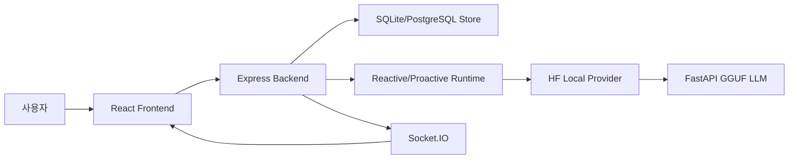

# 01. 프로젝트 개요

## 이번 문서의 학습 목표

이 문서는 삼마고가 어떤 문제를 해결하려고 만들어졌고, 최종 구현물이 어떤 형태인지 설명한다. 여기서 프로젝트의 목적을 잡아야 이후 아키텍처와 코드 흐름을 읽을 때 "왜 이렇게 복잡하게 나누었는가"를 이해할 수 있다.

## 앞 문서와의 연결

[README.md](README.md)에서 전체 학습 순서를 봤다면, 이제 프로젝트 자체의 목표를 먼저 정리한다. 이 문서의 기준은 루트 [README.md](../README.md), 기존 [ABSORB.md](../ABSORB.md), 현재 코드 구조다.

## 프로젝트가 해결하는 문제

일반적인 챗봇은 사용자가 메시지를 보내면 즉시 assistant가 한 번 답하는 구조가 많다. 삼마고는 이 방식에서 생기는 어색함을 줄이려 한다.

| 문제 | 삼마고의 접근 |
| --- | --- |
| 사용자가 아직 쓰는 중인데 끼어드는 문제 | typing 상태를 서버에 보내고, 응답을 미룬다. |
| 짧은 조각 문장에 너무 빨리 답하는 문제 | 문장 끝 단서로 사용자가 이어 말할 가능성을 본다. |
| 침묵을 무조건 거절로 해석하는 문제 | 침묵 시간을 보고 낮은 압력의 check-in만 제한적으로 보낸다. |
| 감정적으로 무거운 상황에서 질문을 많이 던지는 문제 | 감정 강도가 높으면 짧은 공감 후 기다리는 정책을 쓴다. |
| 긴 답변 하나로만 반응하는 문제 | `MultiMessagePlan`으로 여러 짧은 메시지와 delay를 표현한다. |

## 최종 구현 결과

최종 구현물은 다음 기능을 갖는다.

- QR 기반 가입, QR payload 로그인, 복구 코드 발급
- React 기반 실시간 채팅 화면
- REST API로 사용자 메시지를 저장하고, Socket.IO로 assistant 메시지를 늦게 수신하는 흐름
- typing 상태 전달과 assistant presence 표시
- reactive planner를 통한 지연 응답
- proactive scheduler를 통한 침묵 기반 선제 발화
- SQLite 기본 저장소와 PostgreSQL 선택 저장소
- FastAPI와 llama-cpp-python 기반 로컬 GGUF LLM 서버
- 관리자 전용 `/achrai/` 화면과 64x64 1-bit BMP 키 로그인

## 최초 설계 취지와 최종 구현의 연결

프로젝트의 핵심 취지는 "사용자를 해결 대상으로 밀어붙이지 않는 AI 말동무"다. 코드에서는 이 취지가 다음처럼 구현된다.

| 설계 취지 | 구현 위치 | 구현 방식 |
| --- | --- | --- |
| 부담 낮은 대화 | [prompt-engineering/system-prompt.md](../prompt-engineering/system-prompt.md) | 짧은 check-in, 기다림, 과도한 질문 금지 |
| 입력 중 개입 방지 | [frontend/src/components/ChatPanel.tsx](../frontend/src/components/ChatPanel.tsx), [backend/src/routes/chatRoutes.ts](../backend/src/routes/chatRoutes.ts) | `/api/chat/typing`으로 typing presence 저장 |
| 말할 내용과 시점 분리 | [backend/src/runtime/reactivePlanner.ts](../backend/src/runtime/reactivePlanner.ts), [backend/src/runtime/messageQueue.ts](../backend/src/runtime/messageQueue.ts) | HTTP 응답과 assistant 메시지 전송을 분리 |
| 침묵의 의미 보존 | [scheduler/src/index.ts](../scheduler/src/index.ts), [backend/src/runtime/proactiveLoop.ts](../backend/src/runtime/proactiveLoop.ts) | silence window, cooldown, silence meaning 검사 |
| 안전한 실험 관찰 | [backend/src/routes/adminRoutes.ts](../backend/src/routes/adminRoutes.ts), [frontend/src/components/AdminPanel.tsx](../frontend/src/components/AdminPanel.tsx) | 관리자 대시보드에서 세션과 proactive event 확인 |

## 전체 구조 한눈에 보기

## 실제 파일로 확인하기

- 서비스 설명은 [README.md](../README.md)를 읽는다.
- 패키지 전체 명령은 [package.json](../package.json)을 읽는다.
- 공유 타입 계약은 [shared/src/index.ts](../shared/src/index.ts)를 읽는다.
- 백엔드 조립은 [backend/src/app.ts](../backend/src/app.ts)를 읽는다.
- 프론트 최상위 화면 분기는 [frontend/src/App.tsx](../frontend/src/App.tsx)를 읽는다.

## 자주 헷갈리는 부분

삼마고의 내부 패키지 이름은 아직 `@turinglet/*`이고 QR payload type에도 `turinglet-id`가 남아 있다. 이는 기존 내부 식별자 호환을 위한 것이며, 사용자에게 보이는 제품 이름은 `삼마고`와 `Saammaago`다.

또 하나 헷갈릴 수 있는 점은 백엔드가 사용자 메시지 요청에 바로 assistant 답변을 반환하지 않는다는 점이다. [backend/src/routes/chatRoutes.ts](../backend/src/routes/chatRoutes.ts)는 `202 Accepted`를 돌려주고, 실제 assistant 메시지는 나중에 [backend/src/runtime/messageQueue.ts](../backend/src/runtime/messageQueue.ts)가 저장한 뒤 Socket.IO로 보낸다.

## 반드시 이해해야 할 요점

- 이 프로젝트의 중심은 LLM 문장 생성 자체보다 대화 타이밍 제어다.
- 사용자 입력, 침묵, 감정 강도, cooldown이 모두 응답 여부에 영향을 준다.
- `shared` 타입은 프론트, 백엔드, 스케줄러, provider 사이의 계약이다.
- 로컬 LLM은 필수 경로이며 mock 모드는 현재 기본 실행 흐름이 아니다.

## 다음 문서

다음은 [02-architecture.md](02-architecture.md)에서 폴더와 패키지 구조를 배운다.

