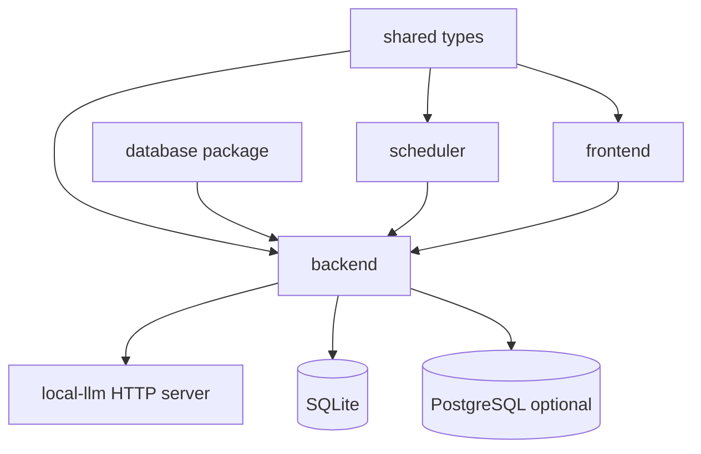

# 02. 아키텍처

## 이번 문서의 학습 목표

이 문서는 삼마고의 모노레포 구조와 각 패키지의 책임을 설명한다. 목표는 "어떤 기능을 고치려면 어느 폴더를 먼저 봐야 하는가"를 판단할 수 있게 되는 것이다.

## 앞 문서와의 연결

[01-project-overview.md](01-project-overview.md)에서 프로젝트가 말동무형 대화 타이밍을 다룬다는 점을 배웠다. 이제 그 목적을 코드 구조가 어떻게 받치고 있는지 본다.

## 모노레포 구조

루트 [package.json](../package.json)은 npm workspace를 사용한다.

```text
frontend/
backend/
shared/
database/
scheduler/
local-llm/
prompt-engineering/
deploy/
```

| 패키지 | 책임 | 먼저 볼 파일 |
| --- | --- | --- |
| [frontend](../frontend/) | 화면, QR 가입/로그인, 채팅 UI, 관리자 UI | [frontend/src/App.tsx](../frontend/src/App.tsx) |
| [backend](../backend/) | API, Socket.IO, 저장소, planner, provider 연결 | [backend/src/app.ts](../backend/src/app.ts) |
| [shared](../shared/) | 공통 타입 계약 | [shared/src/index.ts](../shared/src/index.ts) |
| [database](../database/) | SQLite 경로 해석, migration, seed | [database/src/migrate.ts](../database/src/migrate.ts) |
| [scheduler](../scheduler/) | 선제 발화 가능 여부 판단 | [scheduler/src/index.ts](../scheduler/src/index.ts) |
| [local-llm](../local-llm/) | GGUF 모델을 로드하는 FastAPI 서버 | [local-llm/server.py](../local-llm/server.py) |

## 의존 관계



중요한 방향은 `shared`가 아래에서 타입을 제공하고, `backend`가 대부분의 런타임 의존성을 조립한다는 점이다. `frontend`는 백엔드 API와 socket event에 의존하지만, DB나 LLM을 직접 알지 않는다.

## 백엔드의 계층

백엔드는 [backend/src/app.ts](../backend/src/app.ts)가 composition root 역할을 한다. 여기에서 store, provider, generator, orchestrator, queue, reactive planner, proactive scheduler, routes를 조립한다.

| 계층 | 폴더 | 역할 |
| --- | --- | --- |
| route | [backend/src/routes](../backend/src/routes/) | HTTP 요청 검증, 인증, 응답 코드 결정 |
| runtime | [backend/src/runtime](../backend/src/runtime/) | timer, queue, Socket.IO emit, background loop |
| engine | [backend/src/engine](../backend/src/engine/) | 반응 정책과 메시지 생성 wrapper |
| adapters | [backend/src/adapters](../backend/src/adapters/) | local LLM HTTP 호출과 결과 검증 |
| db | [backend/src/db](../backend/src/db/) | Store interface와 SQLite/PostgreSQL 구현 |
| utils | [backend/src/utils](../backend/src/utils/) | QR payload, admin bitmap, security helper |

## 프론트엔드의 계층

프론트엔드는 [frontend/src/App.tsx](../frontend/src/App.tsx)가 화면을 세 갈래로 나눈다.

| 조건 | 표시 컴포넌트 | 역할 |
| --- | --- | --- |
| `/achrai/` 경로 | [AdminPanel.tsx](../frontend/src/components/AdminPanel.tsx) | 관리자 로그인과 대시보드 |
| 세션 있음 | [ChatPanel.tsx](../frontend/src/components/ChatPanel.tsx) | 실시간 대화 |
| 세션 없음 | [AuthPanel.tsx](../frontend/src/components/AuthPanel.tsx) | QR 가입/로그인 |

전역 상태는 [frontend/src/store.ts](../frontend/src/store.ts)의 Zustand store가 맡고, 백엔드 주소와 API 타입은 [frontend/src/api.ts](../frontend/src/api.ts)에 모여 있다.

## Local LLM 구조

백엔드는 모델을 직접 로드하지 않는다. [backend/src/adapters/hfLocalProvider.ts](../backend/src/adapters/hfLocalProvider.ts)가 `HF_LOCAL_URL`의 `/v1/generate`를 호출하고, [local-llm/server.py](../local-llm/server.py)가 GGUF 파일을 llama-cpp-python으로 로드해 응답한다.

이 구조의 장점은 Node.js 백엔드와 Python LLM 런타임을 분리할 수 있다는 점이다. 대신 앱 시작 전에 LLM 서버 health check가 통과해야 한다. 이 검사는 [backend/src/runtime/llmHealth.ts](../backend/src/runtime/llmHealth.ts)에 있다.

## 설정과 실행 표면

루트 [package.json](../package.json)의 핵심 script는 다음과 같다.

| 명령 | 의미 |
| --- | --- |
| `npm run migrate` | SQLite migration 실행 |
| `npm run dev` | 백엔드와 프론트 개발 서버 실행 |
| `npm run dev:llm:windows` | Windows에서 local LLM과 앱을 함께 실행 |
| `npm run dev:llm:debian` | Debian에서 local LLM과 앱을 함께 실행 |
| `npm run build` | shared, scheduler, database, backend, frontend 빌드 |
| `npm test` | backend Vitest 실행 |

## 자주 헷갈리는 부분

[database](../database/) 패키지는 migration과 DB 경로 해석을 담당하고, 실제 런타임 query 구현은 [backend/src/db](../backend/src/db/) 안에 있다. 따라서 "DB 관련 코드"라고 해서 한 폴더만 보면 부족하다.

또한 [scheduler](../scheduler/)는 독립 패키지지만 서버를 직접 실행하지 않는다. 백엔드의 [proactiveLoop.ts](../backend/src/runtime/proactiveLoop.ts)가 `evaluateProactiveDecision`을 호출해 active session을 순회한다.

## 반드시 이해해야 할 요점

- `backend/src/app.ts`는 전체 의존성 연결을 볼 때 가장 중요한 파일이다.
- `shared/src/index.ts`는 프론트와 백엔드 사이의 타입 계약이다.
- local LLM은 HTTP adapter 뒤에 숨겨져 있어 backend는 provider interface만 본다.
- 프론트는 `AuthPanel`, `ChatPanel`, `AdminPanel`로 기능 단위가 분리되어 있다.

## 다음 문서

다음은 [03-execution-flow.md](03-execution-flow.md)에서 실제 실행 흐름을 따라간다.

