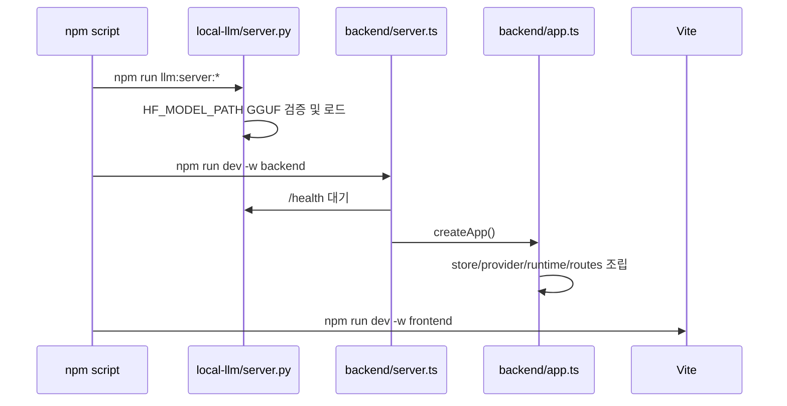
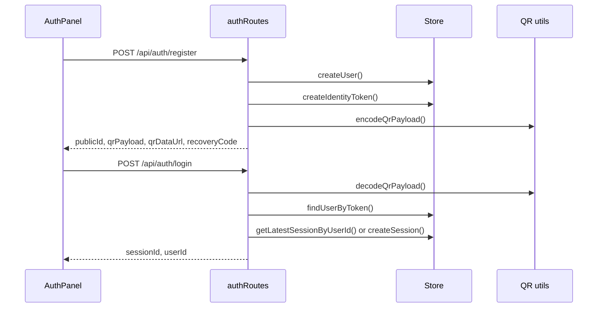
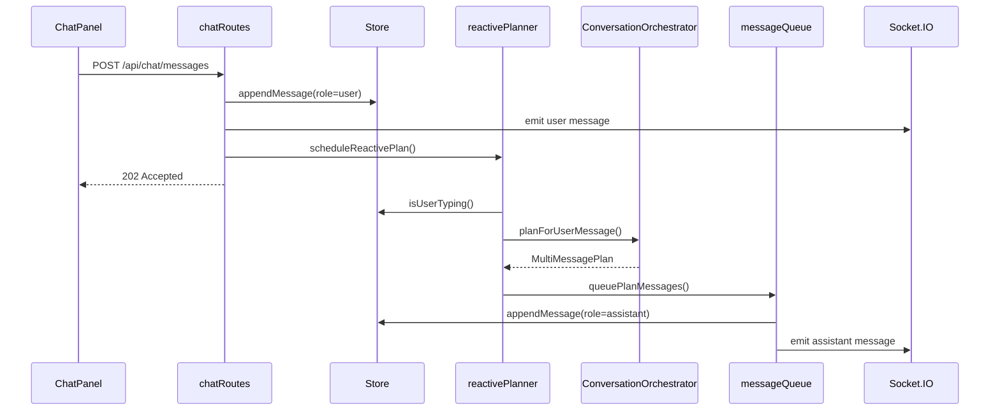

# 03. 실행 흐름

## 이번 문서의 학습 목표

이 문서는 앱이 시작되고, 사용자가 가입하고, 메시지를 보내고, assistant 메시지가 지연 전송되는 흐름을 순서대로 설명한다. 코드 구조를 아는 것에서 한 걸음 더 나아가 런타임에서 어떤 일이 일어나는지 이해하는 것이 목표다.

## 앞 문서와의 연결

[02-architecture.md](02-architecture.md)에서 패키지와 계층 구조를 봤다. 이제 그 구조가 실제 요청과 timer, socket event로 어떻게 움직이는지 본다.

## 앱 시작 흐름



[backend/src/server.ts](../backend/src/server.ts)는 먼저 [waitForLocalLlm](../backend/src/runtime/llmHealth.ts)을 호출한다. `HF_LOCAL_URL`의 `/health`가 준비되지 않으면 백엔드는 시작을 실패 처리한다.

## 가입과 로그인 흐름



관련 파일은 [frontend/src/components/AuthPanel.tsx](../frontend/src/components/AuthPanel.tsx), [backend/src/routes/authRoutes.ts](../backend/src/routes/authRoutes.ts), [backend/src/utils/qrPayload.ts](../backend/src/utils/qrPayload.ts), [backend/src/utils/security.ts](../backend/src/utils/security.ts)다.

처음 로그인하는 사용자에게는 [authRoutes.ts](../backend/src/routes/authRoutes.ts)가 assistant greeting 메시지를 하나 저장한다.

## reactive 채팅 흐름

사용자 메시지에 대한 기본 흐름은 "HTTP 요청 결과로 답변을 바로 받지 않는다"는 점이 핵심이다.



[backend/src/routes/chatRoutes.ts](../backend/src/routes/chatRoutes.ts)는 사용자 메시지를 저장하고 `202 Accepted`를 반환한다. 이후 [backend/src/runtime/reactivePlanner.ts](../backend/src/runtime/reactivePlanner.ts)가 typing 여부와 continuation 가능성을 보고 실제 응답 계획을 계산한다. 최종 전송은 [backend/src/runtime/messageQueue.ts](../backend/src/runtime/messageQueue.ts)가 담당한다.

## typing 흐름

[frontend/src/components/ChatPanel.tsx](../frontend/src/components/ChatPanel.tsx)는 입력값이 바뀔 때 `/api/chat/typing`에 `isTyping: true`를 보내고, 4초 후 `false`를 보낸다. 서버는 [backend/src/routes/chatRoutes.ts](../backend/src/routes/chatRoutes.ts)에서 이를 저장하고 socket으로 `user_typing` event를 보낸다.

이 값은 두 곳에서 중요하다.

- [reactivePlanner.ts](../backend/src/runtime/reactivePlanner.ts)는 typing 중이면 assistant 응답을 미룬다.
- [messageQueue.ts](../backend/src/runtime/messageQueue.ts)는 전송 직전에도 typing을 다시 확인해 끼어들지 않는다.

## proactive 선제 발화 흐름

```mermaid
sequenceDiagram
    participant Loop as proactiveLoop
    participant Store as Store
    participant Scheduler as scheduler
    participant Generator as MessageGenerator
    participant Orchestrator as ConversationOrchestrator
    participant Queue as messageQueue

    Loop->>Store: listActiveSessions()
    Loop->>Store: getConversationSnapshot()
    Loop->>Store: getLastProactiveEventAt()
    Loop->>Scheduler: evaluateProactiveDecision()
    Scheduler-->>Loop: shouldSend
    Loop->>Store: listMessages(limit=5)
    Loop->>Generator: inferSilence()
    Loop->>Orchestrator: planForSilence()
    Loop->>Queue: queuePlanMessages(source=proactive)
    Loop->>Store: recordProactiveEvent()
```

선제 발화 조건 자체는 [scheduler/src/index.ts](../scheduler/src/index.ts)에 있고, 실제 active session을 순회하는 background loop는 [backend/src/runtime/proactiveLoop.ts](../backend/src/runtime/proactiveLoop.ts)에 있다.

## 관리자 화면 흐름

관리자 화면은 일반 화면에 버튼으로 노출되지 않는다. [frontend/src/App.tsx](../frontend/src/App.tsx)는 path가 `/achrai/`이면 [AdminPanel.tsx](../frontend/src/components/AdminPanel.tsx)를 보여준다.

백엔드 시작 시 [backend/src/app.ts](../backend/src/app.ts)가 [createAndSaveAdminBitmap](../backend/src/utils/adminBitmap.ts)을 호출해 `runtime/achrai-admin-key.bmp`를 만든다. 관리자는 해당 BMP를 업로드하고, [backend/src/routes/adminRoutes.ts](../backend/src/routes/adminRoutes.ts)는 파일 digest가 이번 실행의 키와 일치하는지 검사한 뒤 bearer token을 발급한다.

## production 흐름

`NODE_ENV=production`이면 [backend/src/app.ts](../backend/src/app.ts)가 [frontend/dist](../frontend/)를 static file로 제공한다. 클라우드 배포 스크립트 [deploy/cloud-run.sh](../deploy/cloud-run.sh)는 GGUF 모델 파일 존재를 먼저 확인한 뒤 `saammaago-llm`, `saammaago-app` systemd 서비스를 만든다.

## 자주 헷갈리는 부분

사용자 메시지 API가 성공했다고 assistant 메시지가 이미 생성된 것은 아니다. `202 Accepted`는 "사용자 메시지는 저장됐고 응답 계획은 비동기로 진행 중"이라는 뜻이다.

또 proactive event는 발화 후보가 실제 queue에 들어간 뒤 기록된다. [messageQueue.ts](../backend/src/runtime/messageQueue.ts)는 전송 직전에 typing이면 메시지를 보내지 않을 수 있으므로, 발송 기록과 실제 socket 전송이 완전히 같은 의미는 아니다.

## 반드시 이해해야 할 요점

- 사용자 메시지 저장, LLM 계획 생성, assistant 메시지 전송은 서로 다른 단계다.
- reactive 흐름은 사용자의 방금 입력에 반응한다.
- proactive 흐름은 silence window와 cooldown을 보고 먼저 말을 걸지 판단한다.
- Socket.IO는 session room 단위로 메시지와 presence를 전달한다.

## 다음 문서

다음은 [04-core-components.md](04-core-components.md)에서 각 모듈과 주요 식별자의 역할을 더 자세히 본다.

