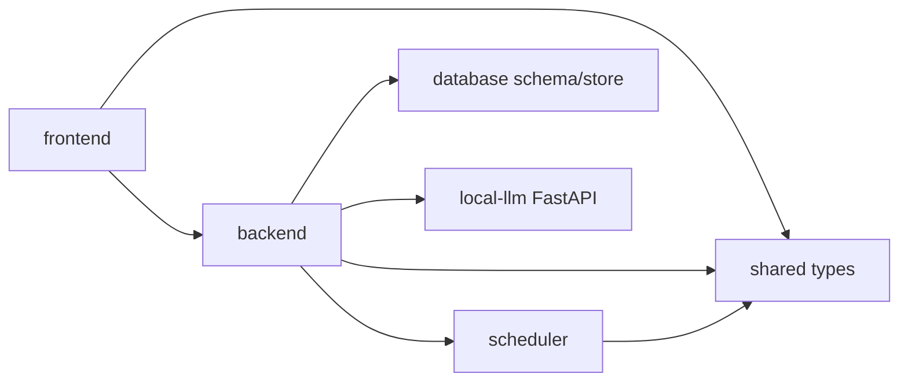

# 03. 프로젝트 지도

## 이번 문서의 학습 목표

- 저장소의 주요 디렉터리와 책임을 파악한다.
- 처음 읽어야 할 파일과 나중에 봐도 되는 파일을 구분한다.
- 코드와 문서, 설정, 산출물의 역할을 혼동하지 않는다.

## 앞 문서와의 연결

[02-prerequisites.md](02-prerequisites.md)에서 실행 준비를 봤다. 이제 어디에 어떤 코드가 있는지 지도부터 만든다.

## 먼저 생각해 볼 질문

사용자 메시지가 프론트에서 출발해 DB에 저장되고 assistant 메시지로 돌아오기까지, 몇 개의 패키지를 지나갈까?

## 디렉터리 구조

```text
.
├── frontend/
├── backend/
├── shared/
├── database/
├── scheduler/
├── local-llm/
├── prompt-engineering/
├── screenshots/
├── deploy/
├── archive/
└── ABSORB/
```

## 패키지별 책임

| 경로 | 책임 | 먼저 읽을 파일 |
| --- | --- | --- |
| [frontend/](../frontend/) | React UI, QR 인증 화면, 채팅 화면, 관리자 화면 | [frontend/src/App.tsx](../frontend/src/App.tsx), [frontend/src/components/ChatPanel.tsx](../frontend/src/components/ChatPanel.tsx) |
| [backend/](../backend/) | Express API, Socket.IO, runtime timer, DB store, provider 조립 | [backend/src/app.ts](../backend/src/app.ts), [backend/src/server.ts](../backend/src/server.ts) |
| [shared/](../shared/) | 여러 패키지가 공유하는 타입 계약 | [shared/src/index.ts](../shared/src/index.ts) |
| [database/](../database/) | migration, seed, DB 경로 유틸 | [database/migrations/001_init.sql](../database/migrations/001_init.sql) |
| [scheduler/](../scheduler/) | proactive 발화 eligibility 판단 | [scheduler/src/index.ts](../scheduler/src/index.ts) |
| [local-llm/](../local-llm/) | FastAPI 기반 로컬 GGUF 모델 서버 | [local-llm/server.py](../local-llm/server.py) |
| [prompt-engineering/](../prompt-engineering/) | 실행 정책의 설계 프롬프트 자료 | [prompt-engineering/system-prompt.md](../prompt-engineering/system-prompt.md) |
| [deploy/](../deploy/) | Debian/Ubuntu service 실행 보조 | [deploy/cloud-run.sh](../deploy/cloud-run.sh) |
| [archive/](../archive/) | 이전 분석 문서 보존 | [archive/ABSORB.md](../archive/ABSORB.md) |

## 큰 의존 관계



`frontend`는 직접 DB나 LLM을 만지지 않는다. `backend`가 API와 Socket.IO의 중심이며, `scheduler`는 순수 판단 로직에 가깝다.

## 읽기 우선순위

1. [shared/src/index.ts](../shared/src/index.ts): 데이터 모양을 먼저 잡는다.
2. [backend/src/app.ts](../backend/src/app.ts): 서비스들이 어떻게 조립되는지 본다.
3. [backend/src/routes/chatRoutes.ts](../backend/src/routes/chatRoutes.ts): 사용자 메시지와 typing이 들어오는 길을 본다.
4. [backend/src/runtime/reactivePlanner.ts](../backend/src/runtime/reactivePlanner.ts): 즉시 응답하지 않는 이유를 본다.
5. [backend/src/runtime/messageQueue.ts](../backend/src/runtime/messageQueue.ts): 발송 직전 typing 확인을 본다.
6. [frontend/src/components/ChatPanel.tsx](../frontend/src/components/ChatPanel.tsx): 프론트 이벤트가 어떻게 만들어지는지 본다.

## 리소스와 산출물

| 경로 | 성격 | 주의 |
| --- | --- | --- |
| [.env.example](../.env.example) | 환경 변수 예시 | 실제 `.env`는 커밋하지 않는다. |
| [screenshots/](../screenshots/) | 수동 검증 이미지 | 코드가 직접 참조하지 않을 수 있다. |
| `runtime/` | 실행 중 생성되는 관리자 BMP 등 | `.gitignore` 대상이다. |
| `local-llm/models/` | 로컬 GGUF 모델 위치 후보 | 모델 원본은 자동 덮어쓰지 않는다. |

## 관찰 실습

1. `rg --files` 결과에서 `src/index.ts`가 여러 개 있는 이유를 패키지별로 설명한다.
2. [backend/src/db/store.ts](../backend/src/db/store.ts)를 열고 store interface가 어떤 기능 묶음인지 확인한다.
3. [database/migrations/001_init.sql](../database/migrations/001_init.sql)의 테이블 이름을 읽고, 어떤 기능과 연결되는지 표로 정리한다.

## 자주 헷갈리는 부분

루트 이름은 `turinglet`이고 내부 패키지도 `@turinglet/*`지만, 제품 표시 이름은 삼마고(Saammaago)다. 이름을 바꿀 때 내부 식별자까지 무리하게 바꾸면 호환성과 import 경로가 깨질 수 있다.

## 이해 확인 질문

- `scheduler`를 backend 내부 함수로만 두지 않고 별도 package로 둔 장점은 무엇인가?
- `shared` 타입이 바뀌면 어떤 패키지를 함께 확인해야 하는가?
- `archive/`와 새 `ABSORB/`는 각각 어떤 역할인가?

## 핵심 요약

이 저장소는 기능별 패키지가 분리된 모노레포다. 학습할 때는 실행 명령보다 먼저 데이터 타입과 backend 조립 구조를 읽으면 흐름이 잡힌다.

다음 문서: [04-execution-flow.md](04-execution-flow.md)
