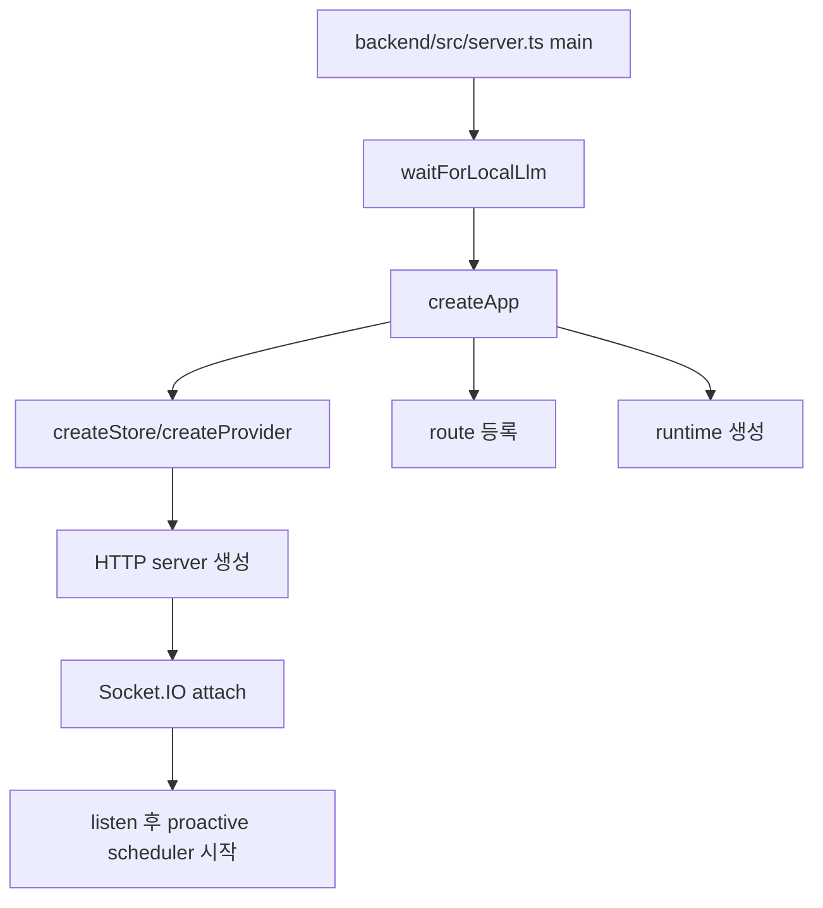
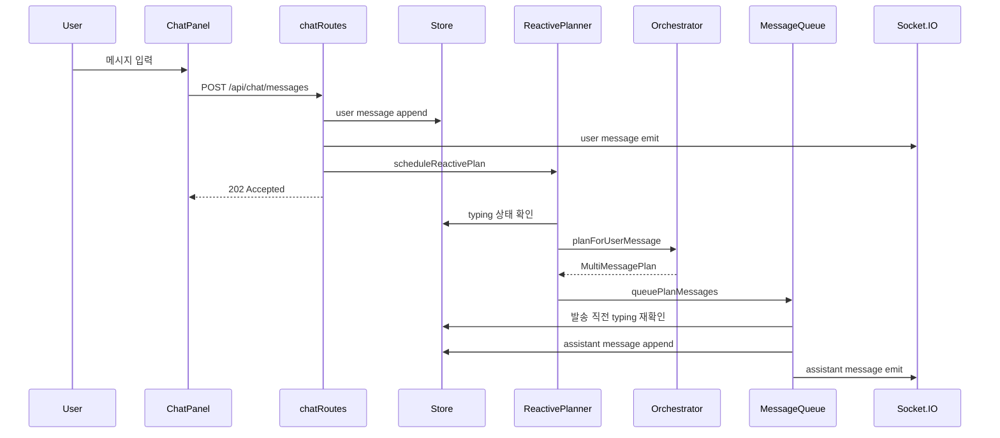
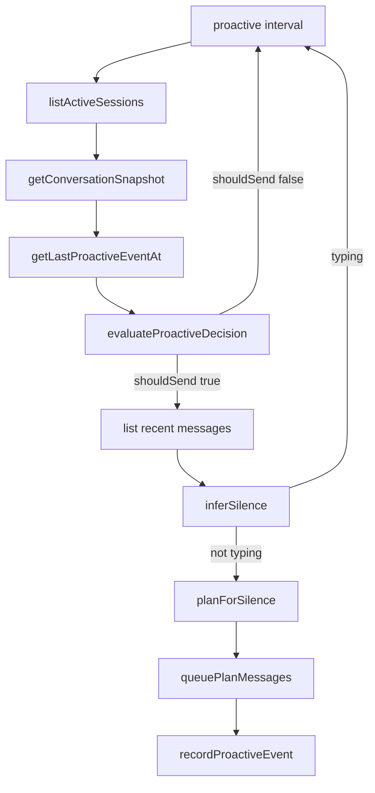

# 04. 실행 흐름

## 이번 문서의 학습 목표

- 앱 시작부터 채팅 메시지 수신까지의 전체 흐름을 따라간다.
- reactive 응답과 proactive 발화의 차이를 이해한다.
- HTTP, timer, Socket.IO가 각각 어디에 쓰이는지 구분한다.

## 앞 문서와의 연결

[03-project-map.md](03-project-map.md)에서 폴더 지도를 봤다. 이제 실제 실행 중 어떤 순서로 파일들이 연결되는지 본다.

## 먼저 생각해 볼 질문

사용자가 메시지를 보낸 직후 HTTP 응답은 `202 Accepted`로 끝난다. 그런데 assistant 메시지는 나중에 도착한다. 누가 나중 발송을 책임질까?

## 서버 시작 흐름

핵심 파일:

- [backend/src/server.ts](../backend/src/server.ts)
- [backend/src/app.ts](../backend/src/app.ts)
- [backend/src/runtime/llmHealth.ts](../backend/src/runtime/llmHealth.ts)

## 사용자 메시지 reactive 흐름

관련 파일:

- [frontend/src/components/ChatPanel.tsx](../frontend/src/components/ChatPanel.tsx)
- [backend/src/routes/chatRoutes.ts](../backend/src/routes/chatRoutes.ts)
- [backend/src/runtime/reactivePlanner.ts](../backend/src/runtime/reactivePlanner.ts)
- [backend/src/engine/orchestrator.ts](../backend/src/engine/orchestrator.ts)
- [backend/src/runtime/messageQueue.ts](../backend/src/runtime/messageQueue.ts)

## proactive 발화 흐름

관련 파일:

- [backend/src/runtime/proactiveLoop.ts](../backend/src/runtime/proactiveLoop.ts)
- [scheduler/src/index.ts](../scheduler/src/index.ts)
- [backend/src/engine/messageGenerator.ts](../backend/src/engine/messageGenerator.ts)

## 인증과 화면 진입

[frontend/src/App.tsx](../frontend/src/App.tsx)는 일반 채팅 화면과 `/achrai/` 관리자 화면을 나눈다. 일반 사용자는 [AuthPanel.tsx](../frontend/src/components/AuthPanel.tsx)에서 QR 기반 가입 또는 로그인 후 session id를 얻고, [ChatPanel.tsx](../frontend/src/components/ChatPanel.tsx)로 들어간다.

관리자 화면은 [AdminPanel.tsx](../frontend/src/components/AdminPanel.tsx)와 [backend/src/routes/adminRoutes.ts](../backend/src/routes/adminRoutes.ts)를 통해 동작하며, 실행 시 생성되는 BMP 키 파일에 의존한다.

## 직접 관찰할 예시

1. [chatRoutes.ts](../backend/src/routes/chatRoutes.ts)의 `POST /api/chat/messages`에서 `res.status(202)` 위치를 찾는다.
2. 바로 아래 `setImmediate` 블록이 사용자 메시지 전송 성공 여부와 분리되어 있는 이유를 설명한다.
3. [messageQueue.ts](../backend/src/runtime/messageQueue.ts)에서 assistant 메시지 저장 직전에 `isUserTyping`을 다시 보는 줄을 찾는다.

## 자주 헷갈리는 부분

reactive planner와 message queue는 둘 다 timer를 다루지만 책임이 다르다. reactive planner는 "계획을 언제 계산할지"를 담당하고, message queue는 "계획된 메시지를 언제 실제 저장/emit할지"를 담당한다.

## 이해 확인 질문

- `POST /api/chat/messages`가 assistant 메시지를 직접 반환하지 않는 이유는 무엇인가?
- proactive 발화가 실패해도 서버 전체가 멈추지 않게 한 구조는 어디에 있는가?
- message queue에서 발송 직전 typing을 다시 확인하지 않으면 어떤 race condition이 생길 수 있는가?

## 핵심 요약

삼마고의 실행 흐름은 HTTP 요청 하나로 끝나지 않는다. 사용자의 메시지는 저장과 emit 후 빠르게 accepted 되고, 실제 assistant 메시지는 planner, orchestrator, queue를 거쳐 나중에 Socket.IO로 도착한다.

다음 문서: [05-core-concepts.md](05-core-concepts.md)
