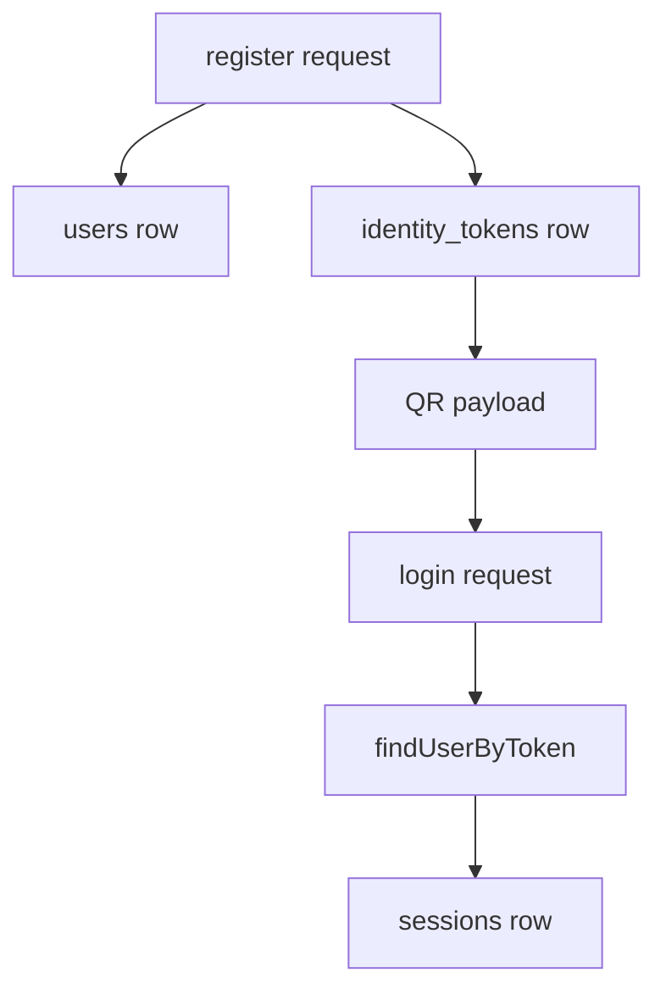

# 05. 데이터 흐름

## 이번 문서의 학습 목표

이 문서는 사용자, 세션, 메시지, typing presence, emotional snapshot, proactive event가 어디에 저장되고 어떻게 읽히는지 설명한다. 목표는 기능 오류가 생겼을 때 데이터 기준으로 원인을 좁힐 수 있게 되는 것이다.

## 앞 문서와의 연결

[04-core-components.md](04-core-components.md)에서는 주요 컴포넌트를 봤다. 이제 그 컴포넌트 사이를 흐르는 데이터를 중심으로 이해한다.

## DB schema

원본 schema는 [database/migrations/001_init.sql](../database/migrations/001_init.sql)에 있다.

| 테이블 | 역할 |
| --- | --- |
| `users` | 사용자 기본 정보와 복구 코드 hash |
| `identity_tokens` | QR payload token의 hash 저장 |
| `sessions` | 사용자 대화 세션 |
| `messages` | user/assistant/system 메시지 |
| `proactive_events` | 선제 발화 판단과 기록 |
| `emotional_state_snapshots` | 최근 감정 강도와 요약 |
| `safety_flags` | 안전 관련 flag 저장용 테이블 |
| `typing_presence` | 세션별 현재 typing 여부 |
| `device_logins` | 기기 로그인 기록용 테이블 |

현재 핵심 실행 흐름에서 가장 자주 쓰이는 테이블은 `users`, `identity_tokens`, `sessions`, `messages`, `typing_presence`, `emotional_state_snapshots`, `proactive_events`다.

## 인증 데이터 흐름



[backend/src/routes/authRoutes.ts](../backend/src/routes/authRoutes.ts)는 `publicId`를 생성하고, [backend/src/utils/security.ts](../backend/src/utils/security.ts)의 hash helper를 통해 token과 recovery code를 저장한다. QR payload 인코딩과 디코딩은 [backend/src/utils/qrPayload.ts](../backend/src/utils/qrPayload.ts)가 맡는다.

## 메시지 데이터 흐름

사용자 메시지는 다음 순서로 흐른다.

1. [ChatPanel.tsx](../frontend/src/components/ChatPanel.tsx)가 `/api/chat/messages`로 content를 보낸다.
2. [chatRoutes.ts](../backend/src/routes/chatRoutes.ts)가 `Store.appendMessage`로 user 메시지를 저장한다.
3. 저장된 user 메시지는 Socket.IO `message` event로 같은 세션 room에 전달된다.
4. reactive planner가 assistant plan을 만들고 queue에 넣는다.
5. [messageQueue.ts](../backend/src/runtime/messageQueue.ts)가 assistant 메시지를 `messages` 테이블에 저장한다.
6. 저장된 assistant 메시지가 Socket.IO로 프론트에 도착한다.

메시지 record의 공통 형태는 [shared/src/index.ts](../shared/src/index.ts)의 `MessageRecord`다.

## ConversationSnapshot

`ConversationSnapshot`은 planner가 판단할 때 필요한 세션 요약이다.

```text
sessionId
lastUserMessageAt
lastAssistantMessageAt
lastMessageAt
recentEmotionalIntensity
userTyping
state
```

이 snapshot은 [backend/src/db/types.ts](../backend/src/db/types.ts)의 `getConversationSnapshot` 계약을 통해 읽힌다. SQLite 구현은 [backend/src/db/sqliteMessages.ts](../backend/src/db/sqliteMessages.ts), PostgreSQL 구현은 [backend/src/db/postgresMessages.ts](../backend/src/db/postgresMessages.ts) 쪽에서 확인할 수 있다.

## Typing presence 흐름

```mermaid
flowchart LR
    Draft[textarea 변경] --> TypingAPI[/api/chat/typing]
    TypingAPI --> DB[typing_presence]
    DB --> Planner[reactive planner]
    DB --> Queue[message queue send 직전 검사]
    TypingAPI --> Socket[user_typing event]
    Socket --> UI[ChatPanel 상태 표시]
```

typing은 advisory signal이다. [ChatPanel.tsx](../frontend/src/components/ChatPanel.tsx)는 typing 전송 실패를 메시지 전송 실패로 처리하지 않는다. 대신 서버가 받을 수 있을 때 더 자연스러운 타이밍 판단에 활용한다.

## Emotional snapshot 흐름

[chatRoutes.ts](../backend/src/routes/chatRoutes.ts)는 사용자 메시지를 받은 뒤 `setImmediate`로 비동기 요약을 실행한다.

1. 최근 메시지 30개를 읽는다.
2. provider의 `summarizeConversationState`를 호출한다.
3. 감정 강도와 요약을 `emotional_state_snapshots`에 저장한다.

이 작업은 사용자 메시지 전송 성공 여부를 막지 않는다. 실패하면 console error만 남기고 넘어간다. 따라서 감정 snapshot이 잠시 늦거나 실패해도 메시지 저장 자체는 성공할 수 있다.

## Proactive event 흐름

[proactiveLoop.ts](../backend/src/runtime/proactiveLoop.ts)는 active session마다 `getLastProactiveEventAt`을 읽고, [scheduler/src/index.ts](../scheduler/src/index.ts)의 cooldown 판단에 넘긴다. 선제 발화가 queue에 들어가면 `recordProactiveEvent`로 기록한다.

이 기록은 관리자 화면 [AdminPanel.tsx](../frontend/src/components/AdminPanel.tsx)의 "최근 선제 이벤트"에서 볼 수 있다.

## 환경 변수 흐름

환경 변수 예시는 [.env.example](../.env.example)에 있다. 실제 [.env](../.env)는 민감값이나 개인 경로가 있을 수 있어 교재 작성 중 내용은 읽지 않았다.

| 변수 | 영향 |
| --- | --- |
| `PORT` | 백엔드 포트 |
| `DB_PROVIDER` | `sqlite` 또는 `postgres` 선택 |
| `SQLITE_PATH` | SQLite DB 파일 경로 |
| `POSTGRES_URL` | PostgreSQL 연결 문자열 |
| `PROACTIVE_POLL_MS` | proactive loop 주기 |
| `PROACTIVE_MIN_SILENCE_MS` | 선제 발화 최소 침묵 시간 |
| `PROACTIVE_COOLDOWN_MS` | 선제 발화 cooldown |
| `USER_CONTINUATION_GRACE_MS` | 첫 reactive 응답 유예 시간 |
| `REACTIVE_RESPONSE_MAX_WAIT_MS` | 이어 말하기 대기 최대 시간 |
| `HF_LOCAL_URL` | local LLM HTTP 주소 |
| `HF_LOCAL_TIMEOUT_MS` | local LLM 호출 timeout |
| `HF_LOCAL_STARTUP_WAIT_MS` | 백엔드 시작 시 LLM 대기 시간 |
| `HF_CONTEXT_SIZE` | llama context window |
| `HF_MODEL_PATH` | GGUF 모델 파일 경로 |

## 파일 산출물

| 산출물 | 생성 위치 | 의미 |
| --- | --- | --- |
| SQLite DB | 기본 `database/local-dev.db` | 로컬 사용자, 세션, 메시지 저장 |
| 관리자 BMP | `runtime/achrai-admin-key.bmp` | 이번 실행의 관리자 로그인 키 |
| frontend build | `frontend/dist` | production static asset |
| backend build | `backend/dist` | production Node.js entry |

관리자 BMP와 DB 파일은 실행 산출물이다. 원본 데이터나 모델 파일과 달리 재생성될 수 있지만, 로컬 실험 기록이 들어 있을 수 있으므로 임의 삭제 전에 목적을 확인해야 한다.

## 자주 헷갈리는 부분

`safety_flags`와 `device_logins` 테이블은 schema에는 있지만, 현재 핵심 대화 흐름에서 주로 사용되는 테이블은 아니다. 확장 시 schema가 이미 마련되어 있는 부분과 실제 코드가 연결된 부분을 구분해야 한다.

또 PostgreSQL store 구현은 있지만 migration 실행 경로는 SQLite migration 중심이다. `DB_PROVIDER=postgres`를 운영 후보로 쓰려면 PostgreSQL migration 절차를 별도로 점검해야 한다.

## 반드시 이해해야 할 요점

- 메시지는 항상 DB에 저장된 뒤 socket으로 전달된다.
- snapshot은 여러 테이블의 최근 상태를 planner 판단에 맞게 요약한 값이다.
- typing은 실패해도 메시지 전송을 막지 않는 보조 신호다.
- `.env`의 모델 경로와 timeout 설정은 앱 실행 성공 여부에 직접 영향을 준다.

## 다음 문서

다음은 [06-implementation-details.md](06-implementation-details.md)에서 정책과 알고리즘의 구체적 판단 기준을 배운다.

