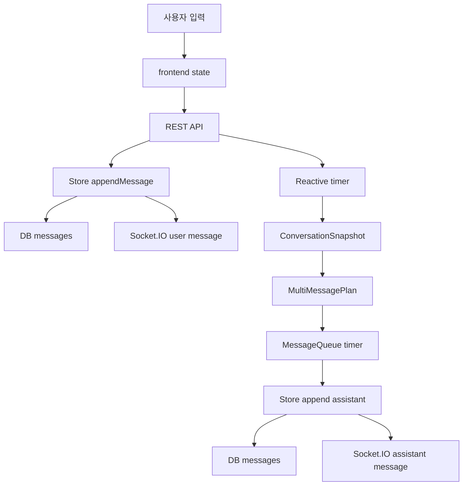

# 07. 데이터와 상태 흐름

## 이번 문서의 학습 목표

- 입력, 상태 변화, 저장, 출력의 흐름을 추적한다.
- DB 테이블과 runtime state의 차이를 이해한다.
- 어떤 정보가 영속되고 어떤 정보가 메모리에만 있는지 구분한다.

## 앞 문서와의 연결

[06-code-walkthrough.md](06-code-walkthrough.md)에서 파일별 역할을 봤다. 이제 데이터가 실제로 어떻게 이동하는지 본다.

## 먼저 생각해 볼 질문

서버가 재시작되면 DB에 남는 것은 무엇이고, 사라지는 timer 상태는 무엇일까?

## 데이터 흐름 개요

## 주요 테이블

원본 schema는 [database/migrations/001_init.sql](../database/migrations/001_init.sql)에 있다.

| 테이블 | 역할 | 연결 기능 |
| --- | --- | --- |
| `users` | QR identity를 가진 사용자 | 가입/로그인 |
| `identity_tokens` | 사용자 식별 token | QR payload |
| `sessions` | 사용자별 대화 세션 | 채팅 화면과 메시지 |
| `messages` | user/assistant 메시지 append | 채팅 기록 |
| `typing_presence` | 입력 중 상태 | interruption 방지 |
| `proactive_events` | 선제 발화 기록 | cooldown과 관리자 관찰 |
| `emotional_state_snapshots` | 최근 감정 강도와 요약 | silence 대응 |
| `safety_flags` | 안전 민감 신호 후보 | 현재 활용 범위 확인 필요 |
| `device_logins` | 기기 로그인 기록 | 인증 이력 |

## 상태의 종류

| 상태 | 저장 위치 | 예 |
| --- | --- | --- |
| 영속 데이터 | SQLite/PostgreSQL | messages, sessions, proactive_events |
| 요약 상태 | DB snapshot row 또는 계산 결과 | emotional intensity, last message timestamps |
| 메모리 runtime | Node process 내부 Map/timer | reactive timers, queue timers, admin token |
| 프론트 상태 | Zustand store와 component state | sessionId, messages, draft |

메모리 runtime은 서버 재시작 시 사라진다. 따라서 pending assistant message를 반드시 복구해야 하는 요구가 생기면 별도 durable queue 설계가 필요하다.

## Typing 상태 흐름

1. 사용자가 textarea에 입력한다.
2. [ChatPanel.tsx](../frontend/src/components/ChatPanel.tsx)의 `onDraftChange`가 `/api/chat/typing`으로 `true`를 보낸다.
3. 4초 timer 후 `false`를 보낸다.
4. [chatRoutes.ts](../backend/src/routes/chatRoutes.ts)가 store에 presence를 저장한다.
5. [reactivePlanner.ts](../backend/src/runtime/reactivePlanner.ts)와 [messageQueue.ts](../backend/src/runtime/messageQueue.ts)가 `isUserTyping`을 확인한다.

## Emotional snapshot 흐름

사용자 메시지 저장 후 route는 background에서 최근 메시지 30개를 provider에 넘겨 요약을 요청한다. 성공하면 store의 `upsertEmotionalSnapshot`으로 저장한다. 이 값은 `ConversationSnapshot.recentEmotionalIntensity`로 들어가 silence 대응에 영향을 준다.

중요한 점은 이 작업이 사용자 메시지 저장 성공과 분리되어 있다는 것이다. 요약 실패를 이유로 사용자 메시지 전송 자체를 실패로 포장하지 않는다.

## Proactive event 흐름

[proactiveLoop.ts](../backend/src/runtime/proactiveLoop.ts)는 active session을 순회한다. 선제 발화를 보내기로 결정하면 queue에 메시지를 넣고 `recordProactiveEvent`를 호출한다. 현재 구조에서는 queue가 발송 직전 typing으로 skip할 수 있으므로, proactive event 기록과 실제 발송 사이에 어긋남이 생길 수 있다. 이 점은 개선 후보로 남아 있다.

## 관찰 실습

1. [database/migrations/001_init.sql](../database/migrations/001_init.sql)에서 `messages` 테이블의 column을 확인하고, [shared/src/index.ts](../shared/src/index.ts)의 `MessageRecord`와 비교한다.
2. [backend/src/db/sqliteMessages.ts](../backend/src/db/sqliteMessages.ts)를 열어 메시지 row가 `MessageRecord`로 바뀌는 지점을 찾는다.
3. [backend/src/db/sqlitePresenceEvents.ts](../backend/src/db/sqlitePresenceEvents.ts)를 열어 typing 상태가 어떻게 저장되고 조회되는지 확인한다.

## 자주 헷갈리는 부분

DB에 있는 `messages`는 대화 기록이고, message queue의 timer는 앞으로 보낼 예약이다. 현재 예약 자체는 DB에 저장되지 않는다.

## 이해 확인 질문

- assistant 메시지가 DB에 저장되는 시점은 plan 생성 시점인가, 실제 발송 시점인가?
- emotional snapshot이 오래되면 proactive 판단에 어떤 영향이 있을 수 있는가?
- proactive event 기록과 실제 message append가 어긋날 수 있는 이유는 무엇인가?

## 핵심 요약

삼마고의 중요한 데이터는 DB에 남지만, 모든 runtime 의도가 영속되는 것은 아니다. 특히 timer 기반 예약은 메모리에 있으므로 재시작과 발송 기록의 정확성을 구분해서 봐야 한다.

다음 문서: [08-debugging-and-testing.md](08-debugging-and-testing.md)
