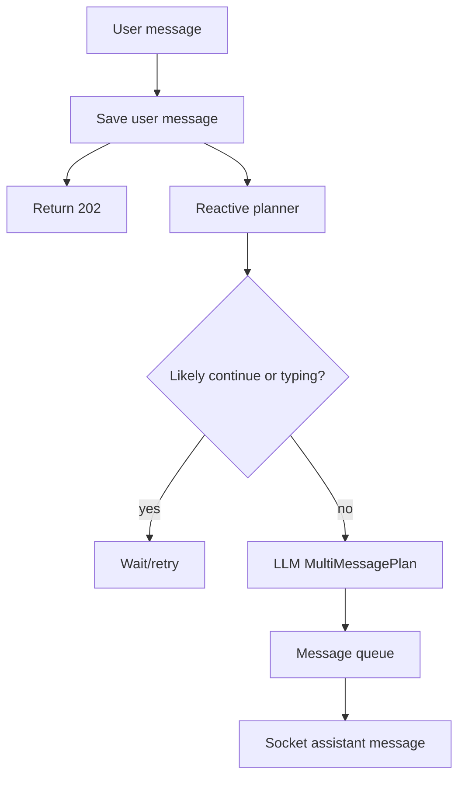

# 09. 면접과 포트폴리오 설명

## 이번 문서의 학습 목표

이 문서는 삼마고를 면접, 포트폴리오, 이력서에서 어떻게 설명할지 정리한다. 목표는 단순히 "AI 챗봇을 만들었다"가 아니라, 어떤 기술적 판단을 했고 무엇을 검증했는지 말할 수 있게 되는 것이다.

## 앞 문서와의 연결

[08-extension-and-maintenance.md](08-extension-and-maintenance.md)까지 읽었다면 프로젝트의 목적, 구조, 흐름, 데이터, 테스트, 유지보수 기준을 모두 봤다. 이제 그 내용을 외부 설명 언어로 바꾼다.

## 30초 요약

삼마고는 사용자가 메시지를 보내면 바로 한 번 답하는 일반 턴제 챗봇이 아니라, typing 상태와 침묵 시간, 감정 강도, 선제 발화 cooldown을 함께 보고 응답 타이밍을 조절하는 AI 말동무 프로토타입입니다. React와 Socket.IO로 실시간 채팅을 만들고, Express 백엔드는 메시지를 저장한 뒤 reactive planner와 proactive scheduler를 통해 assistant 메시지를 지연 전송합니다. 핵심은 "무엇을 말할지"와 "언제 말할지"를 분리한 점입니다.

## 1분 설명

이 프로젝트는 LLM 답변 생성보다 대화 리듬을 구현 대상으로 삼았습니다. 사용자가 메시지를 보내면 서버는 메시지를 DB에 저장하고 `202 Accepted`를 반환합니다. 실제 assistant 답변은 [reactivePlanner.ts](../backend/src/runtime/reactivePlanner.ts)가 typing 상태와 이어 말하기 가능성을 본 뒤 [ConversationOrchestrator](../backend/src/engine/orchestrator.ts)에서 `MultiMessagePlan`으로 계산합니다. plan은 [messageQueue.ts](../backend/src/runtime/messageQueue.ts)에 들어가 delay와 presence 상태에 맞춰 Socket.IO로 전송됩니다. 별도 [scheduler](../scheduler/src/index.ts)는 긴 침묵과 cooldown을 보고 낮은 압력의 선제 발화를 제한적으로 허용합니다. QR 기반 세션 복원과 관리자 대시보드도 있어 실험 상태를 관찰할 수 있습니다.

## 기술적 차별점

| 차별점 | 설명할 코드 |
| --- | --- |
| 타이밍 중심 설계 | [reactivePlanner.ts](../backend/src/runtime/reactivePlanner.ts), [proactiveLoop.ts](../backend/src/runtime/proactiveLoop.ts) |
| shared type 계약 | [shared/src/index.ts](../shared/src/index.ts) |
| LLM output 검증 | [hfLocalProvider.ts](../backend/src/adapters/hfLocalProvider.ts), [hfLocalValidation.ts](../backend/src/adapters/hfLocalValidation.ts) |
| store interface 분리 | [backend/src/db/types.ts](../backend/src/db/types.ts), [sqliteStore.ts](../backend/src/db/sqliteStore.ts), [postgresStore.ts](../backend/src/db/postgresStore.ts) |
| QR 기반 세션 복원 | [authRoutes.ts](../backend/src/routes/authRoutes.ts), [AuthPanel.tsx](../frontend/src/components/AuthPanel.tsx) |
| local model 명시 경로 | [local-llm/server.py](../local-llm/server.py), [.env.example](../.env.example) |

## 이력서 문장 예시

- React, Express, Socket.IO 기반 AI 말동무 프로토타입을 구현하고, 사용자 typing 상태와 침묵 시간을 반영한 비동기 응답 스케줄링 구조를 설계했습니다.
- REST 요청과 assistant 메시지 전송을 분리해 사용자 메시지는 즉시 저장하고, LLM 기반 `MultiMessagePlan`은 message queue에서 delay와 presence 상태에 맞춰 전송하도록 구현했습니다.
- SQLite/PostgreSQL store interface, shared TypeScript 타입, local GGUF LLM provider adapter를 분리해 모듈 간 계약을 명확히 했습니다.
- QR 기반 가입/로그인, 세션 복원, 관리자 BMP 인증 대시보드를 구현해 로컬 실험 관찰과 상태 확인 흐름을 만들었습니다.

## 면접 질문 대응

### 왜 일반 챗봇처럼 바로 답하지 않았나요?

사용자가 아직 말을 이어가는 중일 수 있기 때문입니다. 이 프로젝트의 목표는 답변 생성 자체보다 대화 부담을 낮추는 것이어서, 사용자 메시지를 저장한 뒤 typing 상태와 문장 끝 단서를 보고 응답을 미룹니다. 관련 코드는 [reactivePlanner.ts](../backend/src/runtime/reactivePlanner.ts)와 [orchestrator.ts](../backend/src/engine/orchestrator.ts)입니다.

### LLM output이 깨지면 어떻게 하나요?

백엔드 adapter에서 응답 형태를 검증합니다. [hfLocalValidation.ts](../backend/src/adapters/hfLocalValidation.ts)가 `PresenceState`, `SessionMachineState`, `MultiMessagePlan`을 정규화하고, 유효하지 않으면 오류를 던집니다. Python local LLM 서버도 일부 task에서 JSON fallback을 제공하지만, 최종적으로 backend가 계약을 다시 확인합니다.

### 선제 발화가 사용자에게 부담이 되지 않게 어떻게 제한했나요?

[scheduler/src/index.ts](../scheduler/src/index.ts)가 typing 중인지, user message가 있었는지, silence window가 충분히 길었는지, cooldown이 지났는지를 검사합니다. 감정 강도가 높으면 많은 질문을 하지 않고 짧은 공감 후 기다리는 정책을 사용합니다.

### DB를 바꾸기 쉽게 만들었나요?

[backend/src/db/types.ts](../backend/src/db/types.ts)의 `Store` interface 뒤에 SQLite와 PostgreSQL 구현을 둔 구조입니다. 상위 route와 runtime은 구체 DB driver를 직접 알지 않고 `Store` 메서드만 호출합니다.

### 한계는 무엇인가요?

침묵 해석은 아직 규칙과 작은 local model output에 의존하므로 정확도 한계가 있습니다. 관리자 token은 메모리 저장이라 재시작 후 유지되지 않고, PostgreSQL migration 절차도 SQLite만큼 완성되어 있지는 않습니다. safety-sensitive flow도 schema와 prompt 자료는 있지만 실제 운영 수준의 대응 체계는 아닙니다.

## 데모 체크리스트

데모 전에는 다음을 확인한다.

- `.env`에 유효한 `HF_MODEL_PATH`가 있다.
- `npm run migrate`가 성공한다.
- `curl http://127.0.0.1:8010/health`가 성공한다.
- `curl http://127.0.0.1:4000/api/health`가 성공한다.
- QR 가입 후 로그인할 수 있다.
- 채팅에서 user 메시지가 즉시 보이고 assistant 메시지가 나중에 온다.
- `/achrai/`에서 이번 실행의 관리자 BMP로 로그인할 수 있다.

## 포트폴리오에 포함하면 좋은 다이어그램

이 다이어그램은 프로젝트의 핵심인 비동기 응답 구조를 가장 짧게 보여준다.

## 자주 헷갈리는 부분

이 프로젝트를 "상담 AI"라고 소개하면 범위가 과장된다. README에서도 상담, 의료, 응급 서비스를 대체하지 않는다고 명시한다. 더 정확한 표현은 "대화 타이밍을 실험하는 AI 말동무 프로토타입"이다.

또 "로컬 LLM을 붙였다"보다 "LLM provider를 adapter로 분리하고 output 검증을 둔 구조"를 설명하는 편이 기술적 설득력이 높다.

## 반드시 이해해야 할 요점

- 핵심 차별점은 답변 내용보다 대화 타이밍 제어다.
- reactive와 proactive 흐름을 나눠 설명하면 구조가 명확해진다.
- 한계와 미완성 지점을 솔직하게 말하면 프로젝트 판단이 더 설득력 있다.
- 면접에서는 구체 파일과 함수 이름을 함께 말할 수 있어야 한다.

## 학습 마무리

여기까지 읽었다면 다시 [README.md](README.md)로 돌아가 전체 목차를 훑고, 실제 코드는 [backend/src/app.ts](../backend/src/app.ts), [backend/src/engine/orchestrator.ts](../backend/src/engine/orchestrator.ts), [frontend/src/components/ChatPanel.tsx](../frontend/src/components/ChatPanel.tsx), [local-llm/server.py](../local-llm/server.py) 순서로 직접 열어보는 것을 권장한다.

