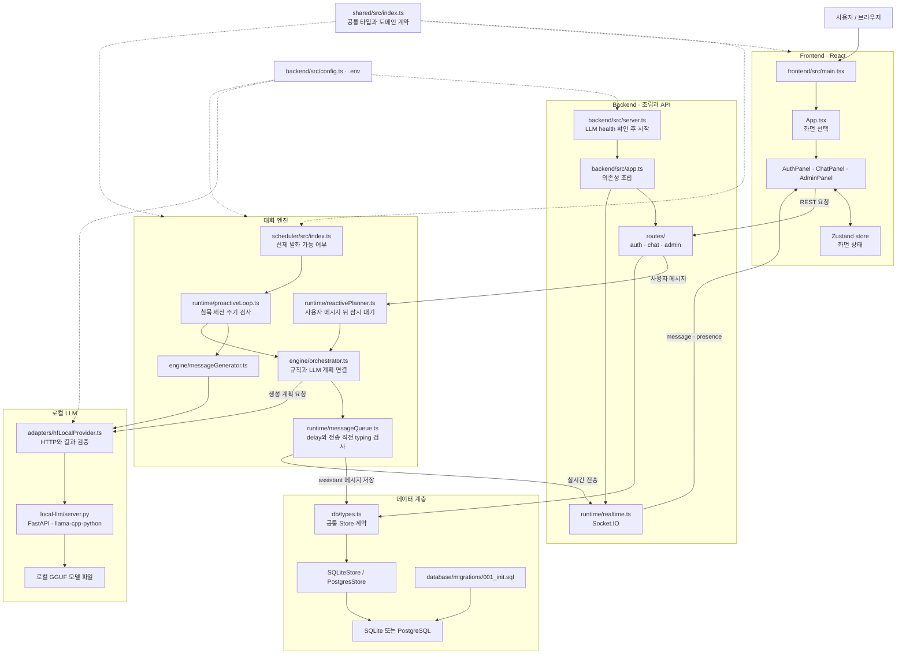

# ABSORB

이 교재는 삼마고(Saammaago) 코드를 읽고, 실행 흐름을 추적하고, 나중에 일부를 직접 고칠 수 있도록 만든 학습 입구입니다. 프로젝트를 홍보하는 문서가 아니라, 코드 안에 들어 있는 설계 판단과 구현 방식을 자기 지식으로 흡수하기 위한 순서형 교재입니다.

## 최종 목표

이 교재를 끝까지 따라가면 다음을 스스로 할 수 있어야 합니다.

- 삼마고가 해결하려는 문제가 일반 챗봇과 어떻게 다른지 설명한다.
- 프론트엔드, 백엔드, DB, 로컬 LLM 서버가 어떤 순서로 연결되는지 추적한다.
- 사용자의 한 메시지가 저장되고, 개수 제한 없는 반응 계획으로 바뀌고, 각 지연 전송 시 typing을 다시 확인하는 흐름을 설명한다.
- 침묵 구간에서 선제 발화가 왜 제한적으로만 실행되는지 설명한다.
- QR 기반 가입/로그인과 세션 복원의 역할을 설명한다.
- 작은 정책 변경을 어느 파일에서 해야 하는지 판단한다.
- 테스트 실패나 실행 실패가 났을 때 확인 순서를 세운다.
- 면접이나 발표에서 본인의 기여와 AI 도움의 범위를 과장 없이 구분한다.

## 학습 대상과 선수 지식

대상 독자는 TypeScript와 React를 조금 읽을 수 있고, Node.js 서버와 HTTP API의 기본 개념을 아는 사람입니다. Python FastAPI와 SQLite/PostgreSQL은 깊이 몰라도 되지만, 함수 호출, JSON, 비동기 처리, 환경 변수는 알고 있어야 합니다.

처음 등장하는 용어는 각 문서에서 다시 정의합니다. 다만 이 교재는 일반 웹 이론을 길게 설명하지 않고, 실제 프로젝트 파일과 연결해서 설명합니다.

## 프로젝트 한 줄 소개

삼마고는 답변 내용만 만드는 챗봇이 아니라, 사용자가 말하는 중인지, 더 말할 것 같은지, 침묵이 길어졌는지를 보고 "언제, 몇 개의 메시지를 보낼지"까지 실험하는 AI 말동무 프로토타입입니다.

원본 소개는 [../README.md](../README.md)를 먼저 훑어보면 좋습니다.

## 전체 코드 구조

아래 그림은 화면 입력이 대화 계획, 로컬 모델, 지연 전송과 저장소를 거쳐 다시 화면으로 돌아오는 전체 구조를 위에서 아래로 보여줍니다. 점선은 공통 타입이나 설정처럼 여러 계층이 함께 참조하는 관계입니다.

구조를 처음 읽을 때는 세로 중심 경로인 `ChatPanel → chat route → reactivePlanner → orchestrator → local LLM → messageQueue → DB/Socket.IO`를 먼저 따라가세요. 침묵 후 먼저 말 걸기는 `scheduler → proactiveLoop`에서 같은 orchestrator와 queue로 합류합니다.

## 학습 순서

| 순서 | 문서 | 배우는 내용 |
| --- | --- | --- |
| 1 | [01-problem-and-goals.md](01-problem-and-goals.md) | 프로젝트가 풀려는 문제와 설계 기준 |
| 2 | [02-prerequisites.md](02-prerequisites.md) | 실행 환경, 의존성, 모델 파일, 환경 변수 |
| 3 | [03-project-map.md](03-project-map.md) | 전체 디렉터리와 패키지 역할 |
| 4 | [04-execution-flow.md](04-execution-flow.md) | 앱 시작, 메시지 전송, 실시간 이벤트 흐름 |
| 5 | [05-core-concepts.md](05-core-concepts.md) | snapshot, presence, plan, proactive/reactive 개념 |
| 6 | [06-code-walkthrough.md](06-code-walkthrough.md) | 핵심 코드 파일별 읽기 순서 |
| 7 | [07-data-and-state-flow.md](07-data-and-state-flow.md) | DB 테이블, Zustand 상태, Socket.IO 이벤트 |
| 8 | [08-debugging-and-testing.md](08-debugging-and-testing.md) | 테스트 전략과 오류 확인 순서 |
| 9 | [09-guided-modifications.md](09-guided-modifications.md) | 작은 기능 변경 실습 |
| 10 | [10-reimplementation.md](10-reimplementation.md) | 핵심 기능을 빈 파일에서 다시 구현하는 연습 |
| 11 | [11-explain-it-yourself.md](11-explain-it-yourself.md) | 자기 말로 설명하기와 최종 점검 |
| 12 | [12-original-code-lab.md](12-original-code-lab.md) | 실제 원본 코드로 실행 흐름, 응답 검증, 다중 메시지 정규화 재추적 |

해설은 [solutions/README.md](solutions/README.md)에서 문서별로 찾아볼 수 있습니다. 퀴즈를 먼저 풀고 해설을 확인하세요.

## 실행 환경

주요 구성은 다음과 같습니다.

- Frontend: React, TypeScript, Vite, Zustand, Socket.IO client
- Backend: Node.js, Express, Socket.IO, Zod, TypeScript
- Database: SQLite 기본, PostgreSQL 선택
- Local LLM: Python FastAPI, llama-cpp-python, GGUF 모델
- Test: Vitest, Supertest

실행 명령은 [../README.md](../README.md)의 "실행 방법"을 따릅니다. 모델 파일은 자동 다운로드하지 않으며, `HF_MODEL_PATH`에 기존 GGUF 파일 경로를 지정해야 합니다.

## 주요 코드 링크

- 앱 조립 지점: [../backend/src/app.ts](../backend/src/app.ts)
- 백엔드 시작점: [../backend/src/server.ts](../backend/src/server.ts)
- 반응 판단 엔진: [../backend/src/engine/orchestrator.ts](../backend/src/engine/orchestrator.ts)
- 반응 계획 스케줄러: [../backend/src/runtime/reactivePlanner.ts](../backend/src/runtime/reactivePlanner.ts)
- 침묵 선제 발화 루프: [../backend/src/runtime/proactiveLoop.ts](../backend/src/runtime/proactiveLoop.ts)
- 메시지 지연 전송 큐: [../backend/src/runtime/messageQueue.ts](../backend/src/runtime/messageQueue.ts)
- 공통 타입: [../shared/src/index.ts](../shared/src/index.ts)
- 프론트 채팅 화면: [../frontend/src/components/ChatPanel.tsx](../frontend/src/components/ChatPanel.tsx)
- 로컬 LLM 서버: [../local-llm/server.py](../local-llm/server.py)
- DB 스키마: [../database/migrations/001_init.sql](../database/migrations/001_init.sql)

## 권장 학습 방법

1. 각 문서의 "먼저 생각해 볼 질문"에 답을 적습니다.
2. 링크된 코드 파일을 직접 열고 함수 이름과 호출 순서를 확인합니다.
3. 실습에서 제안하는 값을 바꾸기 전, 결과를 먼저 예측합니다.
4. 퀴즈 답을 적은 뒤에만 `solutions/` 해설을 봅니다.
5. 마지막 문서에서 프로젝트를 3분 안에 설명하는 연습을 합니다.

## 진도 확인

각 문서 마지막의 퀴즈에 대해 다음 기준으로 표시하세요.

- 읽을 수 있다: 코드 위치와 이름을 찾을 수 있다.
- 설명할 수 있다: 입력, 처리, 출력 또는 부작용을 말할 수 있다.
- 다시 구현할 수 있다: 원본을 닫고 작은 버전을 직접 작성할 수 있다.

다음 문서: [01-problem-and-goals.md](01-problem-and-goals.md)

1~11장을 마친 뒤에는 [12-original-code-lab.md](12-original-code-lab.md)에서 원본 코드와 설명이 실제로 일치하는지 직접 검증하세요.
