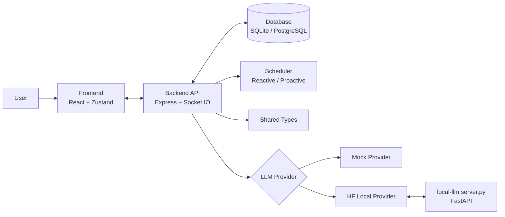

# Turinglet

사용자 발화 내용뿐 아니라 입력 상태와 침묵 구간까지 고려해, 대화 타이밍을 운영하는 이벤트 기반 AI 채팅 프로토타입입니다.

## 한눈에 보기

- 일반적인 1문 1답 챗봇이 아니라, 언제 답할지와 언제 기다릴지를 분리해서 다룹니다.
- 사용자 타이핑 중에는 끼어들지 않고, 중단 시점에 맞춰 반응 계획을 다시 계산합니다.
- 상황에 따라 메시지를 0개, 1개, 여러 개로 나눠 보낼 수 있습니다.
- 로컬 규칙 기반(mock) 모드와 로컬 Hugging Face 모델(hf-local) 모드를 모두 지원합니다.

## 핵심 기능

- 실시간 채팅 UI (Socket.IO)
- 입력 중 상태 전송 및 반영
- 대화 스냅샷 기반 반응 계획 생성
- 침묵 구간 선제 메시지 스케줄링
- QR 기반 가입/로그인과 세션 복원
- 관리자 조회 API (사용자, 세션, 메시지, proactive 이벤트)
- SQLite 기본 지원, PostgreSQL 교체 가능

## 워크스페이스 구조

```text
turinglet/
	frontend/          React + Vite + Zustand
	backend/           Express + Socket.IO + orchestration
	database/          DB migration/seed
	scheduler/         proactive/reactive scheduling policy
	shared/            공용 타입 계약
	local-llm/         로컬 LLM 서버(FastAPI)
```

## 아키텍처 다이어그램 (Mermaid)



설명

- 사용자 메시지는 Frontend에서 Backend로 전달되고, Socket.IO로 실시간 상태와 메시지가 동기화됩니다.
- Backend는 Scheduler 정책을 통해 "지금 답할지, 잠시 기다릴지"를 결정합니다.
- LLM Provider는 환경변수에 따라 mock 또는 hf-local 경로를 선택합니다.

## 빠른 시작

### 1) 의존성 설치

```bash
npm install
```

### 2) 환경 변수 파일 준비

```bash
cp .env.example .env
```

Windows PowerShell에서는 아래를 사용합니다.

```powershell
Copy-Item .env.example .env
```

### 3) DB 준비

```bash
npm run migrate
```

### 4) 앱 실행

```bash
npm run dev
```

기본 접속 주소

- frontend: http://localhost:5173
- backend: http://localhost:4000

## 로컬 LLM 모드(hf-local)

기본값은 mock 모드입니다. 로컬 모델로 실행하려면 아래 두 값을 설정합니다.

```env
LLM_PROVIDER=hf-local
HF_LOCAL_URL=http://127.0.0.1:8010
```

### 권장 실행 순서 (Windows)

```powershell
python -m venv .venv-llm
.\.venv-llm\Scripts\Activate.ps1
python -m pip install --upgrade pip
pip install -r local-llm/requirements.txt
npm run llm:server
```

서버 상태 확인

```powershell
curl.exe http://127.0.0.1:8010/health
```

예상 응답

```json
{"ok":true,"model":"Qwen/Qwen2.5-0.5B-Instruct"}
```

LLM 서버를 켠 뒤에는 앱 서버를 다시 띄우는 것이 안전합니다.

## 자주 쓰는 스크립트

```bash
npm run dev           # backend + frontend 동시 실행
npm run dev:server    # backend만
npm run dev:client    # frontend만
npm run dev:desktop   # backend + frontend + electron
npm run build         # 전체 빌드
npm run test          # backend 테스트
npm run llm:server    # 로컬 LLM 서버 실행
```

## 주요 환경 변수

- PORT: backend 포트 (기본 4000)
- DB_PROVIDER: sqlite 또는 postgres
- SQLITE_PATH: sqlite 파일 경로
- POSTGRES_URL: postgres 연결 문자열
- LLM_PROVIDER: mock 또는 hf-local
- HF_LOCAL_URL: 로컬 LLM 서버 주소
- HF_LOCAL_TIMEOUT_MS: hf-local 요청 타임아웃
- USER_CONTINUATION_GRACE_MS: 사용자가 이어서 입력할 여지를 기다리는 시간
- REACTIVE_RESPONSE_MAX_WAIT_MS: reactive 응답 최대 대기 시간

## 트러블슈팅

### npm run llm:server 실행 실패

- 현재 파이썬 환경이 맞는지 먼저 확인합니다.
- 가상환경을 새로 만들고 requirements를 다시 설치합니다.
- 포트 충돌이 있으면 8010 포트를 점유한 프로세스를 종료합니다.

### OMP: Error #15 또는 OpenMP 충돌

- 새 가상환경에서 패키지를 다시 설치합니다.
- 필요하면 세션에서 KMP_DUPLICATE_LIB_OK=TRUE를 지정합니다.

### 응답이 너무 느리거나 부자연스러움

- LLM_PROVIDER가 hf-local인지 확인합니다.
- health 엔드포인트가 즉시 응답하는지 확인합니다.
- 로컬 모델 품질 한계가 있으므로 모델 크기/종류 변경을 검토합니다.

## 테스트 및 품질 확인

```bash
npm run build
npm run test
```

## 안내

이 저장소는 대화 흐름 제어 실험을 위한 프로토타입입니다. 실제 의료/상담 서비스를 대체하지 않으며, 고위험 상황 대응을 위한 별도 안전 설계가 필요합니다.
